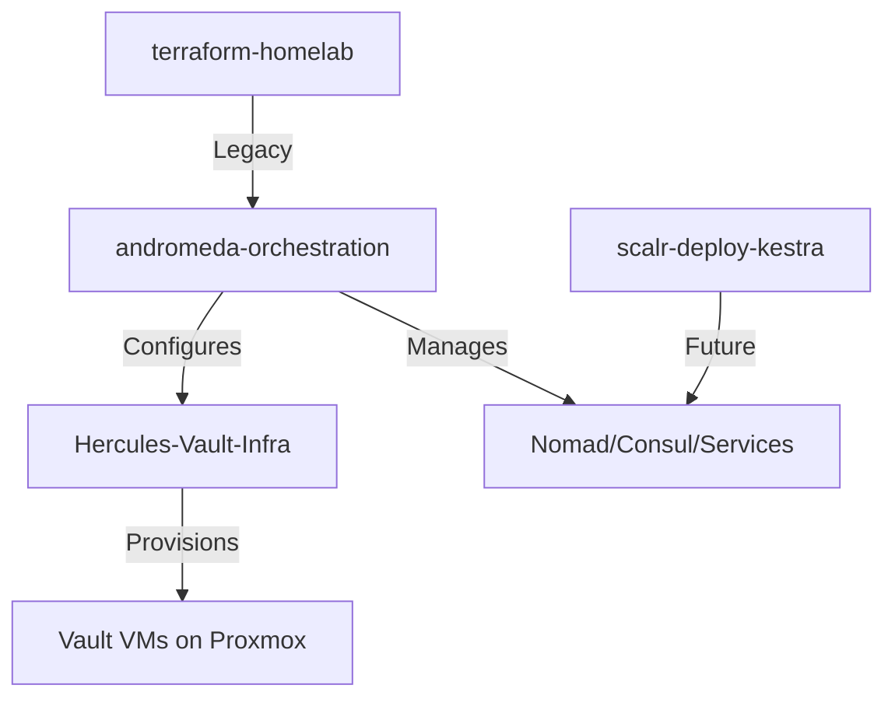
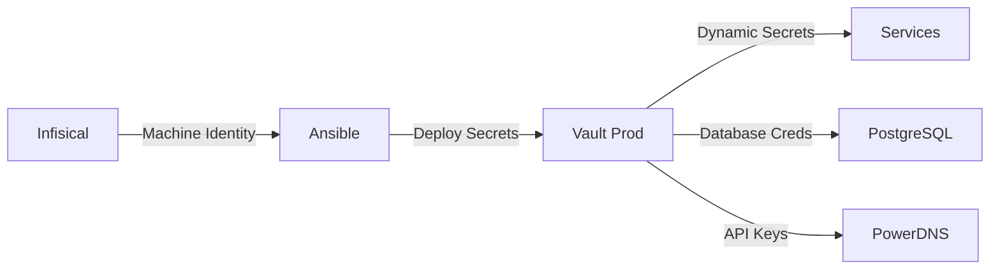

# Infrastructure Repository Cross-Reference


This document provides a comprehensive cross-reference of all infrastructure repositories and their relationships.

## 🏗️ Repository Architecture



## 📚 Active Repositories

### 1. [andromeda-orchestration](https://github.com/basher83/andromeda-orchestration) (This Repo)

**Purpose**: Ansible automation and configuration management

- **Scope**: Service deployment, configuration, orchestration
- **Technologies**: Ansible, Python, Nomad jobs
- **Secrets**: Infisical for all credentials
- **Inventory**: Proxmox, NetBox, Tailscale dynamic inventories

### 2. [Hercules-Vault-Infra](https://github.com/basher83/Hercules-Vault-Infra)

**Purpose**: Terraform infrastructure for dedicated Vault cluster

- **Scope**: VM provisioning, networking, storage
- **Backend**: Scalr remote state management
- **Workspace**: `production-vault`
- **Provider**: Proxmox (bpg/proxmox v0.78+)
- **Architecture**:
  - 1 Transit Master VM (auto-unseal)
  - 3 Production Raft VMs (HA cluster)
  - Total: 14 vCPUs, 28GB RAM, 340GB storage
- **Network**: 192.168.10.30-33
- **Template**: Ubuntu 22.04 (ID: 8000)

### 3. [terraform-homelab](https://github.com/basher83/terraform-homelab) (Active - Nomad/Consul Infrastructure)

**Purpose**: Terraform management of Nomad/Consul cluster infrastructure on Proxmox

- **Status**: Active - Managing production Nomad/Consul cluster VMs
- **Backend**: Scalr remote state management
- **Workspace**: `nomad-prod-infrastructure`
- **VCS Workflow**: PR-based through Scalr (auto-plan on PR, manual apply on merge)
- **Provider**: Proxmox (bpg/proxmox v0.73.2+)
- **Architecture**:
  - 6 VMs total across 3 Proxmox nodes (holly, lloyd, mable)
  - 3 Nomad/Consul servers (192.168.10.11-13, 192.168.11.11-13)
  - 3 Nomad clients (192.168.10.20-22, 192.168.11.20-22)
  - Dual NIC configuration: management (10.0) and operations (11.0)
  - Total: 18 vCPUs, 24GB RAM
- **Template**: Ubuntu 22.04 (ID: 9022)
- **Module Structure**: Unified VM module at `infrastructure/modules/vm/`
- **Note**: Ansible roles for Consul/Nomad configuration imported to andromeda-orchestration

## 🔄 Deployment Workflows

### Vault Cluster Deployment

```bash
# Step 1: Provision infrastructure (Hercules-Vault-Infra)
cd Hercules-Vault-Infra
terraform apply  # Via Scalr VCS trigger

# Step 2: Configure services (andromeda-orchestration)
cd andromeda-orchestration
uv run ansible-playbook playbooks/infrastructure/vault/deploy-vault-prod.yml
```

### Nomad/Consul Cluster Deployment

```bash
# Step 1: Provision infrastructure (terraform-homelab)
cd terraform-homelab
# Create PR for changes -> Scalr auto-plans
# Merge PR -> Manual apply in Scalr UI

# Step 2: Configure services (andromeda-orchestration)
cd andromeda-orchestration
# Configure Consul
uv run ansible-playbook playbooks/infrastructure/consul/deploy-consul.yml
# Configure Nomad
uv run ansible-playbook playbooks/infrastructure/nomad/deploy-nomad.yml
```

### Service Deployment (Nomad)

```bash
# All in andromeda-orchestration
uv run ansible-playbook playbooks/infrastructure/nomad/deploy-job.yml \
  -e job=nomad-jobs/platform-services/service.nomad.hcl
```

## 🔗 Integration Points

### Infrastructure Layer (Terraform)

- **Hercules-Vault-Infra**: Vault cluster VMs (4 VMs)
- **terraform-homelab**: Nomad/Consul cluster VMs (6 VMs)
- **Future**: Consider separate repos for:
  - NetBox infrastructure
  - Monitoring infrastructure
  - Additional service clusters

### Configuration Layer (Ansible)

- **andromeda-orchestration**: All service configuration
- **Inventory Sources**:
  - Proxmox VMs (via plugin)
  - NetBox IPAM (via plugin)
  - Tailscale nodes (via script)

### Orchestration Layer (Nomad)

- **Jobs Directory**: `nomad-jobs/` in andromeda-orchestration
- **Categories**:
  - `core-infrastructure/` - Essential services
  - `platform-services/` - Infrastructure services
  - `applications/` - User-facing apps

## 🔐 Secrets Management Flow



## 📊 Resource Distribution

### By Repository

| Repository | Purpose | Resources | Management |
|------------|---------|-----------|------------|
| Hercules-Vault-Infra | Vault VMs | 14 vCPUs, 28GB RAM, 340GB storage | Terraform/Scalr |
| terraform-homelab | Nomad/Consul VMs | 18 vCPUs, 24GB RAM | Terraform/Scalr |
| andromeda-orchestration | Service Config | N/A (config only) | Ansible |

### By Service

| Service | Repository | Deployment Method |
|---------|------------|-------------------|
| Vault | Hercules-Vault-Infra + andromeda | Terraform (VMs) + Ansible (config) |
| Consul | terraform-homelab + andromeda | Terraform (VMs) + Ansible (config) |
| Nomad | terraform-homelab + andromeda | Terraform (VMs) + Ansible (config) |
| NetBox | andromeda-orchestration | Nomad job |
| PowerDNS | andromeda-orchestration | Nomad job |
| PostgreSQL | andromeda-orchestration | Nomad job |

## 🚀 Future Repository Structure

### Proposed Separation

```
infrastructure/
├── Hercules-Vault-Infra/       # ✅ Exists - Vault cluster
├── terraform-homelab/           # ✅ Exists - Nomad/Consul cluster
├── NetBox-Infra/               # TODO: Dedicated NetBox VMs
└── Monitoring-Infra/           # TODO: Observability stack

configuration/
└── andromeda-orchestration/    # ✅ Current repo

orchestration/
├── nomad-jobs/                 # Currently in andromeda
└── kubernetes-manifests/       # Future consideration
```

## 📝 Migration Notes

### From Monolithic to Modular

1. **Phase 1**: ✅ Vault infrastructure separated (Hercules-Vault-Infra)
2. **Phase 2**: ✅ Nomad/Consul infrastructure managed (terraform-homelab)
3. **Phase 3**: ✅ Configuration management consolidated (andromeda-orchestration)
4. **Phase 4**: TODO - Separate NetBox infrastructure
5. **Phase 5**: TODO - Separate monitoring infrastructure

### Benefits of Separation

- **Clear boundaries**: Infrastructure vs Configuration
- **Independent scaling**: Each layer can evolve separately
- **Team collaboration**: Different teams can own different layers
- **State isolation**: Terraform state per infrastructure component

## 🔍 Related Documentation

### In This Repository

- [Vault Production Deployment](docs/implementation/vault/production-deployment.md)
- [Vault ADR](docs/project-management/decisions/ADR-2025-08-23-vault-production-deployment.md)
- [Infrastructure Standards](docs/standards/infrastructure-standards.md)

### External Repositories

- [Hercules-Vault-Infra README](https://github.com/basher83/Hercules-Vault-Infra)
- [Hercules Requirements Doc](https://github.com/basher83/Hercules-Vault-Infra/blob/main/docs/dedicated-infrastructure-requirements.md)
- [terraform-homelab README](https://github.com/basher83/terraform-homelab)
- [terraform-homelab CLAUDE.md](https://github.com/basher83/terraform-homelab/blob/main/CLAUDE.md)

## 🏷️ Repository Naming Convention

- **Infrastructure repos**: `[Name]-Infra` (e.g., Hercules-Vault-Infra)
- **Configuration repos**: `[Name]-orchestration` (e.g., andromeda-orchestration)
- **Application repos**: `[Name]-app` or just `[Name]`

## ⚠️ Important Notes

1. **State Management**: Each Terraform repo has its own Scalr workspace
2. **Secrets**: All repos use Infisical for secrets management
3. **Version Control**: All repos use semantic versioning for releases
4. **CI/CD**: Scalr VCS triggers for Terraform, GitHub Actions for Ansible
5. **Documentation**: Each repo must have CLAUDE.md for AI assistance

---

Last reviewed: 2025-01-27 | Maintained by: Infrastructure Team
