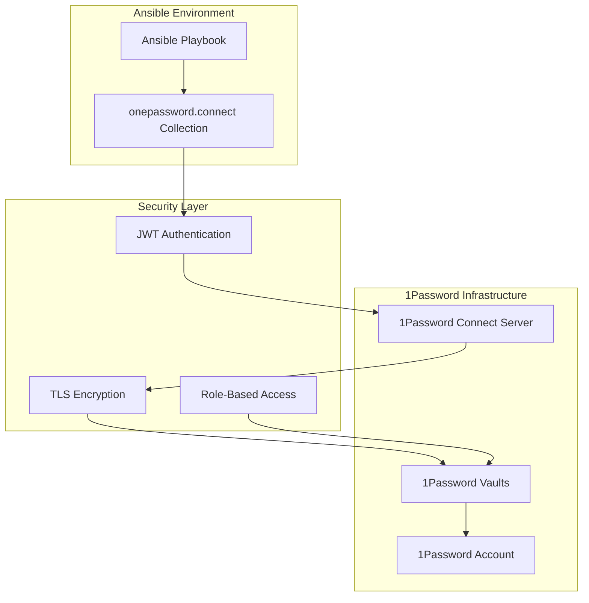

# 1Password Connect Ansible Collection

> **⚠️ DEPRECATED**: This project has migrated to Infisical for secrets management. See [infisical-setup-and-migration.md](infisical-setup-and-migration.md) for current documentation. This guide is retained for reference during the migration period.

## Overview

The `onepassword.connect` Ansible collection (v2.3.0) provides enterprise-grade secret management integration between
Ansible and 1Password through the 1Password Connect API. This collection enables secure, automated management of
passwords, API keys, and other sensitive data within Ansible playbooks while following infrastructure-as-code principles.

**Key Features:**

- Secure CRUD operations for 1Password items
- Automatic password generation with configurable recipes
- Multi-vault support for environment separation
- Enterprise security with JWT authentication
- Comprehensive field type support
- Idempotent operations following Ansible best practices

## Architecture

### System Components



### Collection Modules

| Module             | Purpose                    | Primary Use Cases                                                  |
| ------------------ | -------------------------- | ------------------------------------------------------------------ |
| **`generic_item`** | Item lifecycle management  | Creating, updating, deleting secrets with full field customization |
| **`item_info`**    | Item information retrieval | Fetching complete item details, multi-vault searches               |
| **`field_info`**   | Targeted field extraction  | Retrieving single field values with section-aware searching        |

## Prerequisites

### System Requirements

| Component           | Version | Purpose                    |
| ------------------- | ------- | -------------------------- |
| `ansible-core`      | ≥2.15   | Core Ansible functionality |
| `python`            | ≥3.9    | Runtime environment        |
| `1Password Connect` | ≥1.0.0  | API server                 |

### 1Password Connect Setup

1. **Deploy 1Password Connect Server** with Docker or Kubernetes
2. **Generate API Token** with appropriate vault access permissions
3. **Configure Network Access** from Ansible control node to Connect server
4. **Set Up Vaults** for different environments (dev/staging/prod)

## Installation

```bash
# Install collection from Ansible Galaxy
ansible-galaxy collection install onepassword.connect

# Verify installation
ansible-doc onepassword.connect.generic_item
```

## Configuration

### Environment Variables

| Variable           | Description                     | Required |
| ------------------ | ------------------------------- | -------- |
| `OP_CONNECT_HOST`  | URL of 1Password Connect server | Yes      |
| `OP_CONNECT_TOKEN` | JWT authentication token        | Yes      |
| `OP_VAULT_ID`      | Default vault UUID (optional)   | No       |

### Security Configuration

```yaml
# ansible.cfg
[defaults]
no_log = True  # Global setting for sensitive operations

# group_vars/all.yml (encrypted with ansible-vault)
op_connect_host: "https://connect.company.com"
op_connect_token: "{{ vault_op_connect_token }}"
production_vault_id: "{{ vault_production_vault_id }}"
staging_vault_id: "{{ vault_staging_vault_id }}"
```

## Security Best Practices

### 1. Token Management

**✅ Recommended Approach:**

```yaml
- name: Create secret
  onepassword.connect.generic_item:
    token: "{{ vault_op_connect_token }}" # Direct parameter
    hostname: "{{ op_connect_host }}"
    # ... other parameters
  no_log: true # CRITICAL: Always use this
```

**❌ Avoid:**

```yaml
# Don't use environment variables for tokens in production
- name: Create secret
  onepassword.connect.generic_item:
    # Relies on OP_CONNECT_TOKEN environment variable
  no_log: true
```

### 2. Sensitive Data Protection

**Always use `no_log: true`** for tasks that handle sensitive data:

```yaml
- name: Retrieve database credentials
  onepassword.connect.item_info:
    token: "{{ vault_op_connect_token }}"
    item: "Database Credentials"
    vault: "{{ db_vault_id }}"
  no_log: true # Prevents secrets from appearing in logs
  register: db_creds

- name: Use credentials safely
  debug:
    msg: "Database configured successfully" # Don't log actual credentials
```

### 3. Vault Organization

```yaml
# Environment-specific vault organization
vault_mapping:
  development: "{{ dev_vault_id }}"
  staging: "{{ staging_vault_id }}"
  production: "{{ prod_vault_id }}"

# Use dynamic vault selection
target_vault: "{{ vault_mapping[environment] }}"
```

## Module Usage Examples

### Creating Secrets with Password Generation

```yaml
- name: Create API credentials with generated secret
  onepassword.connect.generic_item:
    hostname: "{{ op_connect_host }}"
    token: "{{ vault_op_connect_token }}"
    vault_id: "{{ app_vault_id }}"
    title: "{{ application_name }}-api-credentials"
    category: api_credential
    state: present
    fields:
      - label: "api_key"
        field_type: concealed
        generate_value: on_create # Only generate if doesn't exist
        generator_recipe:
          length: 64
          include_letters: true
          include_digits: true
          include_symbols: false
        section: "Authentication"
      - label: "api_url"
        field_type: url
        value: "{{ api_endpoint }}"
        section: "Configuration"
      - label: "environment"
        field_type: string
        value: "{{ target_environment }}"
        section: "Metadata"
    tags:
      - "{{ application_name }}"
      - "{{ target_environment }}"
      - "api-credentials"
  no_log: true
  register: api_credentials
```

### Retrieving Existing Secrets

```yaml
- name: Get database connection details
  onepassword.connect.item_info:
    hostname: "{{ op_connect_host }}"
    token: "{{ vault_op_connect_token }}"
    item: "{{ database_name }}-connection"
    vault: "{{ db_vault_id }}"
    flatten_fields_by_label: true
  no_log: true
  register: db_connection

- name: Extract specific password field
  onepassword.connect.field_info:
    hostname: "{{ op_connect_host }}"
    token: "{{ vault_op_connect_token }}"
    item: "{{ database_name }}-connection"
    field: "password"
    vault: "{{ db_vault_id }}"
    section: "Database Credentials"
  no_log: true
  register: db_password
```

### Updating Secrets

```yaml
- name: Update existing secret with new configuration
  onepassword.connect.generic_item:
    hostname: "{{ op_connect_host }}"
    token: "{{ vault_op_connect_token }}"
    vault_id: "{{ app_vault_id }}"
    uuid: "{{ existing_secret_id }}" # Update by UUID
    title: "{{ application_name }}-updated-config"
    state: present
    fields:
      - label: "password"
        field_type: concealed
        generate_value: never # Preserve existing password
      - label: "last_updated"
        field_type: string
        value: "{{ ansible_date_time.iso8601 }}"
        section: "Metadata"
  no_log: true
  register: updated_secret
```

## Advanced Configuration

### Password Generation Recipes

```yaml
# Strong password for high-security environments
strong_password_recipe:
  length: 32
  include_letters: true
  include_digits: true
  include_symbols: true

# API key format (alphanumeric only)
api_key_recipe:
  length: 64
  include_letters: true
  include_digits: true
  include_symbols: false

# PIN format (digits only)
pin_recipe:
  length: 6
  include_letters: false
  include_digits: true
  include_symbols: false
```

### Field Types and Use Cases

| Field Type  | Use Case                     | Example                        |
| ----------- | ---------------------------- | ------------------------------ |
| `concealed` | Passwords, API keys, secrets | Database passwords, JWT tokens |
| `string`    | General text data            | Usernames, descriptions        |
| `email`     | Email addresses              | Service account emails         |
| `url`       | Web addresses                | API endpoints, service URLs    |
| `otp`       | TOTP secrets                 | Two-factor authentication      |
| `date`      | Date values                  | Expiration dates               |

### Item Categories

```yaml
# Choose appropriate category for proper 1Password organization
categories:
  login: "USERNAME + PASSWORD combinations"
  password: "Standalone passwords"
  api_credential: "API keys and service credentials"
  server: "Server access credentials"
  database: "Database connection information"
  secure_note: "General encrypted notes"
```

## Error Handling

### Common Error Patterns

```yaml
- name: Create secret with error handling
  block:
    - name: Attempt to create secret
      onepassword.connect.generic_item:
        hostname: "{{ op_connect_host }}"
        token: "{{ vault_op_connect_token }}"
        vault_id: "{{ app_vault_id }}"
        title: "{{ secret_name }}"
        state: present
        fields: "{{ secret_fields }}"
      no_log: true
      register: secret_result

  rescue:
    - name: Handle authentication errors
      fail:
        msg: "Failed to authenticate with 1Password Connect. Check token and permissions."
      when: "'AccessDeniedError' in ansible_failed_result.msg"

    - name: Handle network errors
      fail:
        msg: "Cannot reach 1Password Connect server. Check network connectivity."
      when: "'ConnectionError' in ansible_failed_result.msg"

    - name: Handle vault access errors
      fail:
        msg: "Cannot access specified vault. Check vault ID and permissions."
      when: "'NotFoundError' in ansible_failed_result.msg"

  always:
    - name: Log operation completion
      debug:
        msg: "Secret operation completed"
```

## Integration Patterns

### Role-Based Secret Management

```yaml
# roles/app_secrets/tasks/main.yml
---
- name: Create application secrets
  onepassword.connect.generic_item:
    hostname: "{{ op_connect_host }}"
    token: "{{ vault_op_connect_token }}"
    vault_id: "{{ hostvars[inventory_hostname].vault_id }}"
    title: "{{ app_name }}-{{ item.name }}"
    category: "{{ item.category | default('api_credential') }}"
    state: present
    fields: "{{ item.fields }}"
    tags: "{{ item.tags | default([]) + [app_name, environment] }}"
  loop: "{{ app_secrets }}"
  no_log: true
  register: created_secrets

# roles/app_secrets/defaults/main.yml
---
app_secrets:
  - name: "database-connection"
    category: "database"
    fields:
      - label: "username"
        field_type: "string"
        value: "{{ db_user }}"
      - label: "password"
        field_type: "concealed"
        generate_value: "on_create"
        generator_recipe: "{{ strong_password_recipe }}"
    tags: ["database", "backend"]
```

### Dynamic Secret Rotation

```yaml
- name: Rotate API key
  block:
    - name: Generate new API key
      onepassword.connect.generic_item:
        hostname: "{{ op_connect_host }}"
        token: "{{ vault_op_connect_token }}"
        vault_id: "{{ app_vault_id }}"
        title: "{{ service_name }}-api-key-new"
        state: present
        fields:
          - label: "api_key"
            field_type: concealed
            generate_value: always # Force new generation
            generator_recipe: "{{ api_key_recipe }}"
      no_log: true
      register: new_api_key

    - name: Update application with new key
      # Deploy new key to application

    - name: Verify new key works
      # Test application functionality

    - name: Remove old API key
      onepassword.connect.generic_item:
        hostname: "{{ op_connect_host }}"
        token: "{{ vault_op_connect_token }}"
        vault_id: "{{ app_vault_id }}"
        title: "{{ service_name }}-api-key"
        state: absent
      no_log: true

    - name: Rename new key to primary
      onepassword.connect.generic_item:
        hostname: "{{ op_connect_host }}"
        token: "{{ vault_op_connect_token }}"
        vault_id: "{{ app_vault_id }}"
        uuid: "{{ new_api_key.op_item.id }}"
        title: "{{ service_name }}-api-key"
        state: present
      no_log: true
```

## Testing and Validation

### Check Mode Support

```yaml
# Dry run to see what would change
- name: Test secret creation (check mode)
  onepassword.connect.generic_item:
    hostname: "{{ op_connect_host }}"
    token: "{{ vault_op_connect_token }}"
    vault_id: "{{ app_vault_id }}"
    title: "test-secret"
    state: present
    fields:
      - label: "password"
        field_type: concealed
        generate_value: on_create
  check_mode: true
  no_log: true
  register: check_result

- name: Display what would be created
  debug:
    msg: "Would create secret: {{ check_result.op_item.title }}"
  when: check_result.changed
```

### Integration Testing

```yaml
# Test 1Password Connect connectivity
- name: Verify 1Password Connect access
  onepassword.connect.item_info:
    hostname: "{{ op_connect_host }}"
    token: "{{ vault_op_connect_token }}"
    item: "connectivity-test"
    vault: "{{ test_vault_id }}"
  no_log: true
  register: connectivity_test
  failed_when: false

- name: Validate connection
  assert:
    that:
      - connectivity_test is not failed
    fail_msg: "Cannot connect to 1Password Connect server"
    success_msg: "1Password Connect connectivity verified"
```

## Troubleshooting

### Common Issues

| Issue               | Cause                                     | Solution                                     |
| ------------------- | ----------------------------------------- | -------------------------------------------- |
| `AccessDeniedError` | Invalid token or insufficient permissions | Check token validity and vault access        |
| `NotFoundError`     | Item/vault not found                      | Verify vault ID and item existence           |
| `ConnectionError`   | Network connectivity issues               | Check Connect server status and network      |
| Secrets in logs     | Missing `no_log: true`                    | Always add `no_log: true` to sensitive tasks |

### Debug Mode

```yaml
# Enable debug output (remove in production)
- name: Debug secret retrieval
  onepassword.connect.field_info:
    hostname: "{{ op_connect_host }}"
    token: "{{ vault_op_connect_token }}"
    item: "debug-item"
    field: "debug-field"
    vault: "{{ debug_vault_id }}"
  register: debug_result
  # Note: no_log removed for debugging only

- name: Show debug info (safe metadata only)
  debug:
    msg:
      - "Item ID: {{ debug_result.field.id }}"
      - "Section: {{ debug_result.field.section }}"
  # Never log actual field values
```

## Migration and Maintenance

### Collection Updates

```bash
# Update to latest version
ansible-galaxy collection install onepassword.connect --force

# Check version
ansible-galaxy collection list | grep onepassword.connect
```

### Backup and Recovery

```yaml
- name: Export vault items for backup
  onepassword.connect.item_info:
    hostname: "{{ op_connect_host }}"
    token: "{{ vault_op_connect_token }}"
    item: "{{ item }}"
    vault: "{{ backup_vault_id }}"
  loop: "{{ vault_items }}"
  no_log: true
  register: backup_items
# Store backup_items in encrypted format
```

## Conclusion

The 1Password Connect Ansible collection provides a robust, enterprise-grade solution for secret management that
integrates seamlessly with Ansible automation workflows. By following the security best practices and patterns outlined
in this documentation, you can implement secure, scalable secret management that maintains the principles of
infrastructure as code while protecting sensitive data.

**Key Takeaways:**

- Always use `no_log: true` for sensitive operations
- Prefer direct token parameters over environment variables
- Implement proper error handling and validation
- Use appropriate field types and categories
- Follow DRY principles with variables and roles
- Test thoroughly with check mode before production deployment
