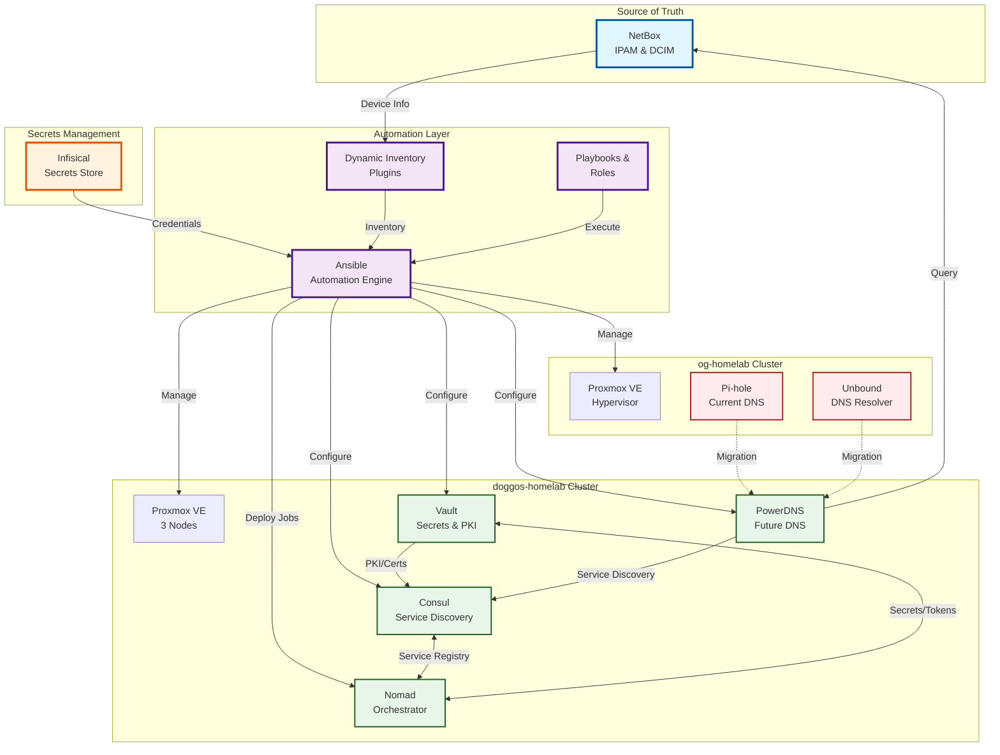

# High-Level Architecture Overview

This diagram shows the overall architecture of the andromeda-orchestration automation project and how all components interact.

## Key Components

### Source of Truth

- **NetBox**: Central repository for all network device information, IP addressing, and infrastructure documentation

### Secrets Management

- **Infisical**: Secure storage for all credentials, API tokens, and sensitive configuration data

### Automation Layer

- **Ansible**: Core automation engine executing all infrastructure changes
- **Dynamic Inventory**: Pulls real-time data from Proxmox clusters and (future) NetBox
- **Playbooks & Roles**: Organized automation code for different infrastructure tasks

### Infrastructure Clusters

- **og-homelab**: Original cluster currently running DNS services (Pi-hole + Unbound)
- **doggos-homelab**: Modern 3-node cluster running Consul and Nomad, target for new DNS infrastructure

### Migration Path

The dotted lines show the planned migration from Pi-hole/Unbound to PowerDNS integrated with NetBox and Consul.
