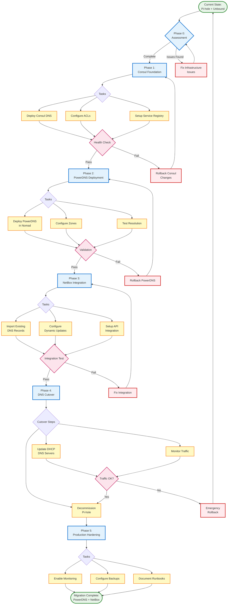

# DNS & IPAM Migration Flow

This diagram illustrates the phased migration approach from the current DNS infrastructure to the target NetBox-integrated solution.

## Migration Phases

### Phase 0: Infrastructure Assessment
- Validate current infrastructure health
- Document existing DNS configuration
- Identify and fix any blocking issues

### Phase 1: Consul Foundation
- Deploy Consul DNS on port 8600
- Configure ACLs and encryption
- Establish service discovery baseline

### Phase 2: PowerDNS Deployment
- Deploy PowerDNS via Nomad jobs
- Configure initial zones and forwarders
- Validate DNS resolution functionality

### Phase 3: NetBox Integration
- Import existing DNS records to NetBox
- Configure PowerDNS to use NetBox as backend
- Setup dynamic record management

### Phase 4: DNS Cutover
- Update DHCP to point to new DNS servers
- Monitor traffic and validate resolution
- Decommission legacy Pi-hole infrastructure

### Phase 5: Production Hardening
- Enable comprehensive monitoring
- Configure automated backups
- Create operational runbooks

## Rollback Strategy

Each phase includes specific rollback procedures:
- **Phase 1**: Revert Consul configuration
- **Phase 2**: Remove PowerDNS deployment
- **Phase 3**: Disconnect NetBox integration
- **Phase 4**: Emergency rollback to Pi-hole
- **Phase 5**: No rollback needed (hardening only)

## Decision Points

Critical go/no-go decisions occur at:
1. End of Phase 0 assessment
2. Consul health check (Phase 1)
3. PowerDNS validation (Phase 2)
4. NetBox integration test (Phase 3)
5. Traffic validation during cutover (Phase 4)