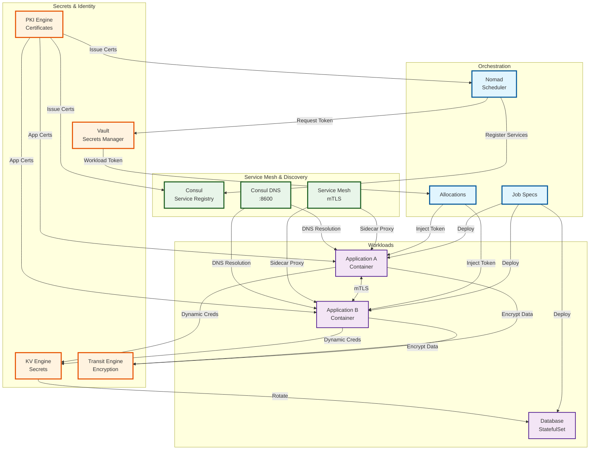
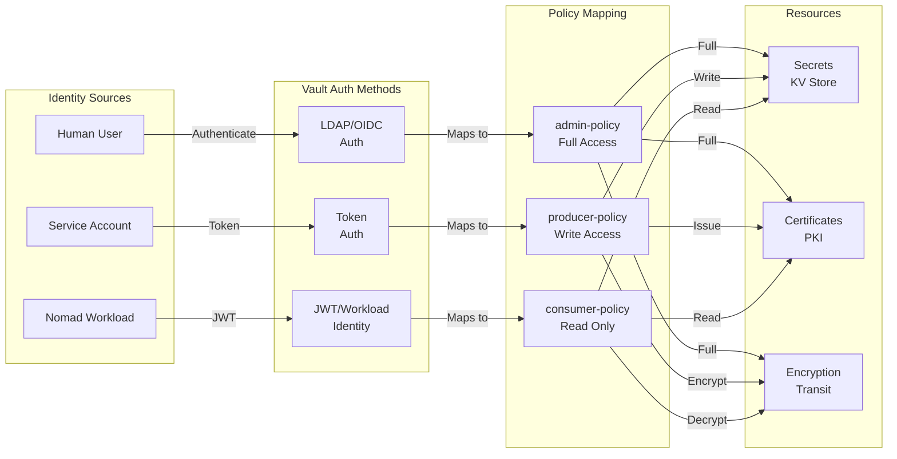
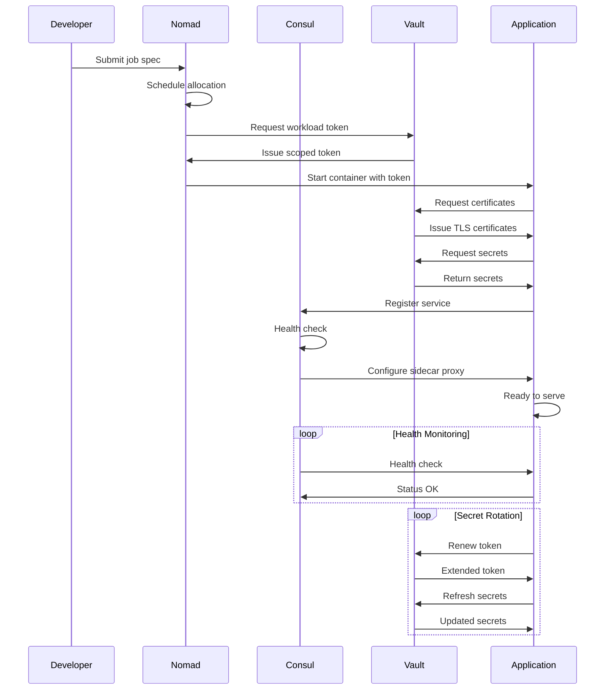
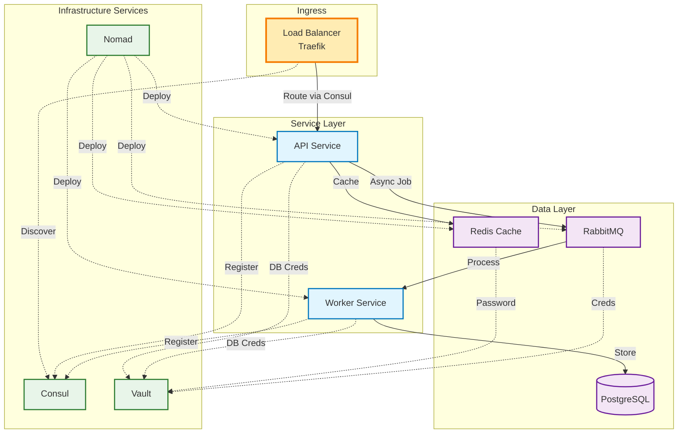

# HashiCorp Stack Integration

This diagram illustrates how Consul, Vault, and Nomad work together as an integrated platform.

## Complete Stack Integration

## Authentication & Authorization Flow

## Service Lifecycle

## Data Flow Patterns

## Integration Benefits

### Service Discovery (Consul)

- **Automatic registration**: Services register on startup
- **Health checking**: Continuous monitoring
- **DNS interface**: Simple service resolution
- **Load balancing**: Client-side and proxy-based

### Secrets Management (Vault)

- **Dynamic credentials**: Short-lived, auto-rotated
- **PKI as a Service**: Automated certificate management
- **Encryption as a Service**: Application-level encryption
- **Audit trail**: Complete secret access logging

### Orchestration (Nomad)

- **Workload identity**: Automatic Vault integration
- **Service registration**: Automatic Consul integration
- **Resource management**: CPU, memory, network isolation
- **Rolling updates**: Zero-downtime deployments

### Combined Power

- **Zero-trust networking**: mTLS everywhere via Consul Connect
- **Automated PKI**: Vault issues certs, Consul distributes
- **Dynamic configuration**: Consul KV + Vault secrets
- **Unified workflows**: Single job spec for complete deployment
