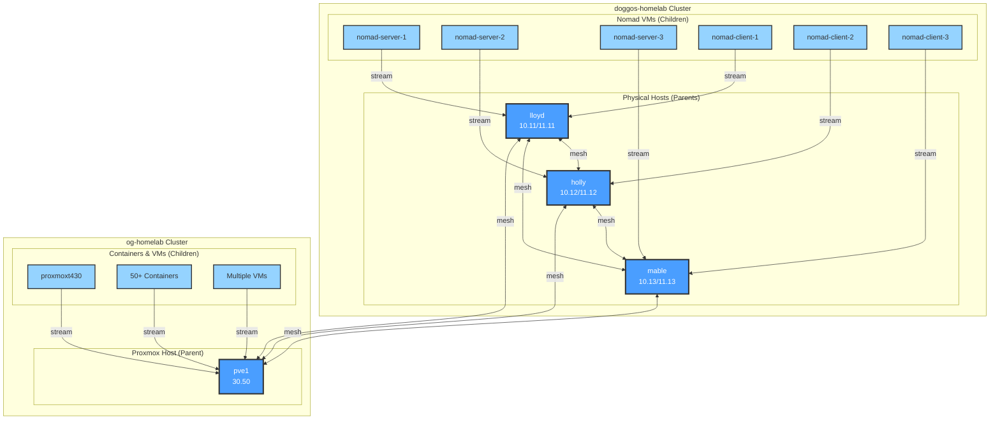

# Netdata Mesh Topology Diagram

## Overview

This diagram illustrates the Netdata monitoring architecture with parent-child streaming and parent-to-parent mesh replication across multiple clusters.

## Architecture Diagram



## Data Flow Details

### Child → Parent Streaming (Blue Lines)

- **Protocol**: HTTP/HTTPS on port 19999
- **Direction**: Unidirectional (child to parent)
- **Authentication**: API key per cluster
- **Compression**: Enabled by default
- **Buffering**: 30 seconds on network failure

### Parent ↔ Parent Mesh (Red Dashed Lines)

- **Protocol**: HTTP/HTTPS on port 19999
- **Direction**: Bidirectional replication
- **Authentication**: Mesh-specific API key
- **Full Mesh**: Each parent connects to all others
- **Total Connections**: 12 (4 nodes × 3 peers each)

## Network Topology

### doggos-homelab Networks

```text
Management: 192.168.10.0/24 (1G) - Used for mesh cross-cluster
Data:       192.168.11.0/24 (10G) - Used for child streaming
```

### og-homelab Network

```text
Single:     192.168.30.0/24 (2.5G) - All traffic
```

### Cross-Cluster Routing

- og-homelab (30.0/24) → doggos management (10.0/24)
- doggos nodes use dual-NIC configuration
- Mesh traffic uses management network for cross-cluster

## Benefits of Mesh Topology

1. **Unified Monitoring**
   - Access all ~60+ nodes from any parent
   - Single pane of glass for entire infrastructure

2. **High Availability**
   - 4 parent nodes provide redundancy
   - Automatic failover if parent fails
   - No single point of failure

3. **Load Distribution**
   - Query any parent node
   - Distribute dashboard load
   - Parallel query processing

4. **Cross-Cluster Visibility**
   - View og-homelab from doggos cluster
   - View doggos cluster from og-homelab
   - Correlate metrics across locations

## Access Points

### Web Dashboards

- [http://lloyd:19999](http://lloyd:19999) - Full infrastructure view
- [http://holly:19999](http://holly:19999) - Full infrastructure view
- [http://mable:19999](http://mable:19999) - Full infrastructure view
- [http://192.168.30.50:19999](http://192.168.30.50:19999) - Full infrastructure view

### API Endpoints

- `/api/v1/info` - Node information
- `/api/v1/data` - Query metrics
- `/api/v1/alarms` - Active alarms
- `/api/v1/contexts` - Available metrics

## Configuration Keys

### API Key Architecture

```yaml
# Child streaming keys (per cluster)
vault_netdata_parent_api_key: "doggos-child-key"
vault_netdata_parent_api_key_og: "og-child-key"

# Mesh replication key (shared)
vault_netdata_mesh_api_key: "parent-mesh-key"
```

### Resource Allocation

```yaml
# Parent nodes
Memory: dbengine mode
Storage: 1-2GB per parent
Retention: 24 hours detailed

# Child nodes
Memory: RAM mode
Storage: In-memory only
Retention: 1 hour (30min for containers)
```

## Deployment Order

1. **Deploy Parents First**
   - Configure dbengine storage
   - Set up API keys
   - Enable web interface

2. **Deploy Children**
   - Configure streaming destination
   - Disable web interface
   - Minimize plugins

3. **Configure Mesh**
   - Update parent streaming configs
   - Add mesh API key
   - Restart parents

4. **Verify Topology**
   - Check connection counts
   - Test cross-cluster visibility
   - Verify redundancy

## Related Documentation

- [Netdata Role README](../../roles/netdata/README.md)
- [Infrastructure Architecture](../infrastructure/netdata-architecture.md)
- [Deployment Playbooks](../../playbooks/infrastructure/)
