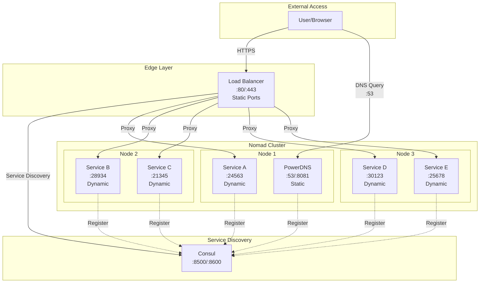
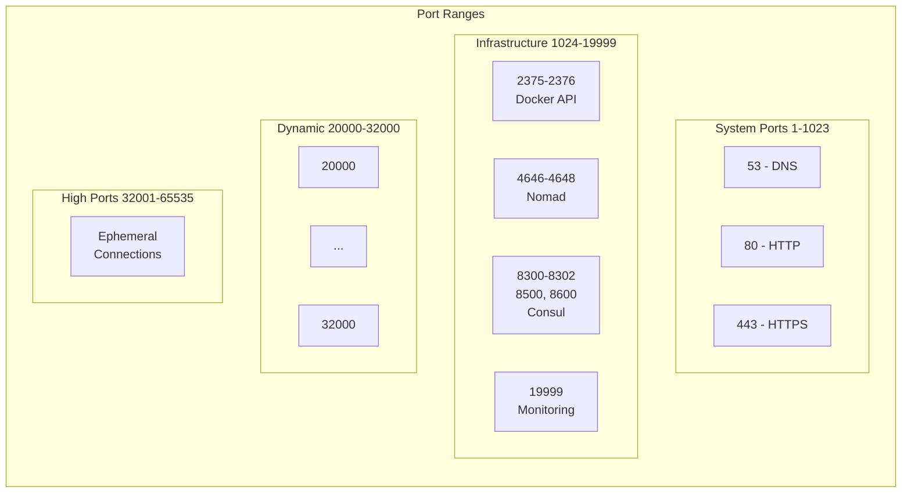
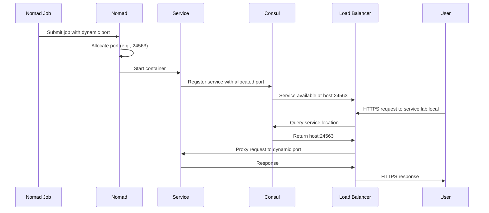
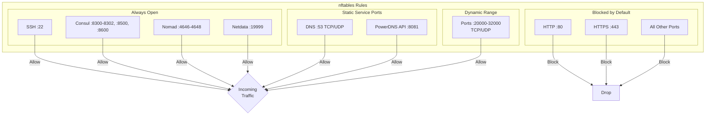
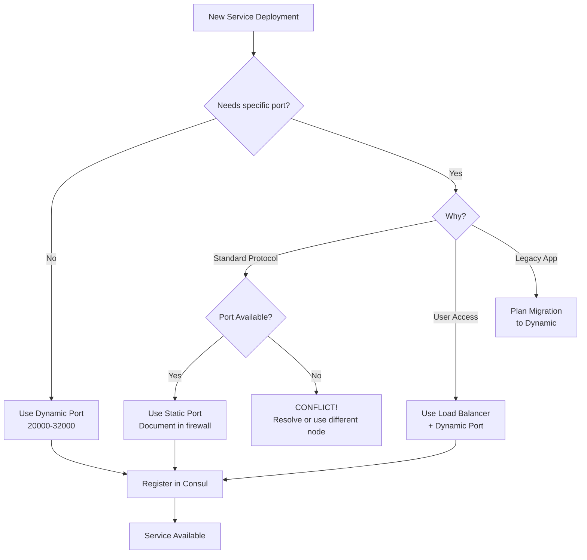
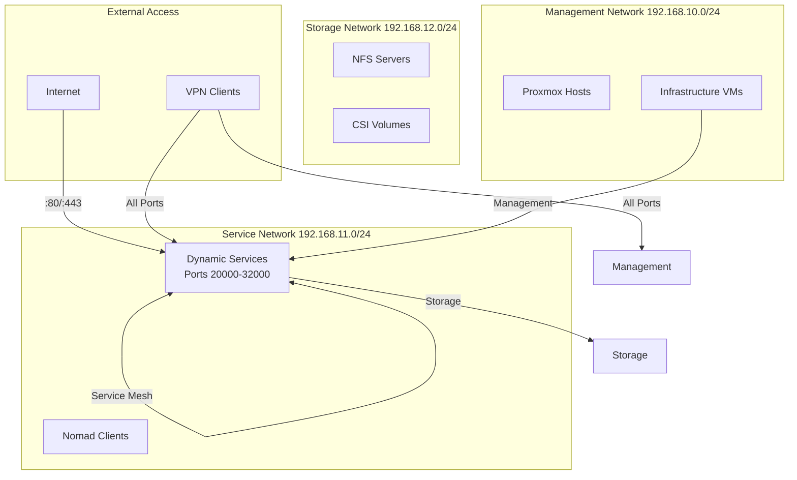

# Network Port Architecture

This diagram illustrates the port allocation and traffic flow patterns in the Nomad-based homelab infrastructure.

## Traffic Flow Overview



## Port Allocation Strategy



## Service Registration Flow



## Firewall Rules Visualization



## Port Conflict Resolution



## Example Service Deployments

### 1. Web Application (Dynamic Port)

```
┌─────────────────┐       ┌──────────────┐       ┌─────────────────┐
│                 │       │              │       │                 │
│  User Browser   │──────▶│ Traefik :443 │──────▶│ Windmill :24563 │
│                 │ HTTPS │              │ HTTP  │                 │
└─────────────────┘       └──────────────┘       └─────────────────┘
                                │                           │
                                ▼                           ▼
                          ┌──────────┐              ┌──────────┐
                          │  Consul  │◀─────────────│ Register │
                          │  Catalog │   Discovery  │ Service  │
                          └──────────┘              └──────────┘
```

### 2. DNS Service (Static Port)

```
┌─────────────────┐       ┌─────────────────┐
│                 │       │                 │
│   DNS Client    │──────▶│  PowerDNS :53   │
│                 │  UDP  │                 │
└─────────────────┘       └─────────────────┘
                                  │
                                  ▼
                          ┌──────────────┐
                          │ PowerDNS API │
                          │    :8081     │
                          └──────────────┘
```

### 3. Multi-Port Microservice

```
┌───────────────┐     ┌─────────────────────────┐     ┌─────────┐
│   Frontend    │────▶│      Microservice       │────▶│ Database│
│               │ :80 │                         │     │         │
└───────────────┘     │  HTTP API :25677       │     └─────────┘
                      │  gRPC     :26788       │
┌───────────────┐     │  Metrics  :27899       │
│  Prometheus   │────▶│  Health   :28900       │
│               │     │                         │
└───────────────┘     └─────────────────────────┘
```

## Network Segments



## Key Principles Illustrated

1. **Dynamic by Default**: Most services use ports 20000-32000
2. **Static Exceptions**: Only DNS (53) and current PowerDNS API (8081)
3. **Single Load Balancer**: One service owns 80/443 for all HTTP(S) traffic
4. **Service Discovery**: All services register with Consul
5. **Internal Communication**: Services use `.consul` domains
6. **Firewall Protection**: Only required ports are open

## Related Documentation

- [Firewall and Port Strategy](../operations/firewall-port-strategy.md)
- [Nomad Port Allocation Best Practices](../implementation/nomad-port-allocation.md)
- [Consul Service Discovery](../implementation/consul/)