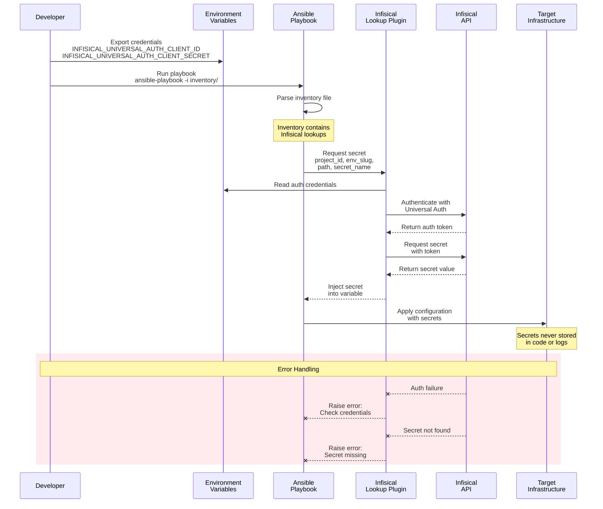

# Secrets Management Flow

This diagram shows how secrets flow from Infisical through Ansible to the target infrastructure.



## Authentication Flow

### 1. Machine Identity Setup (One-time)

```bash
# Developer sets up machine identity credentials
export INFISICAL_UNIVERSAL_AUTH_CLIENT_ID="your-client-id"
export INFISICAL_UNIVERSAL_AUTH_CLIENT_SECRET="your-client-secret"
```

### 2. Secret Retrieval Pattern

```yaml
# In inventory file or playbook
proxmox_token: >-
  {{ (lookup('infisical.vault.read_secrets',
             universal_auth_client_id=lookup('env', 'INFISICAL_UNIVERSAL_AUTH_CLIENT_ID'),
             universal_auth_client_secret=lookup('env', 'INFISICAL_UNIVERSAL_AUTH_CLIENT_SECRET'),
             project_id='7b832220-24c0-45bc-a5f1-ce9794a31259',
             env_slug='prod',
             path='/apollo-13/proxmox',
             secret_name='ANSIBLE_TOKEN')).value }}
```

### 3. Security Features

- **No hardcoded secrets**: All sensitive data retrieved at runtime
- **Encrypted transport**: TLS encryption for API communication
- **Token-based auth**: Short-lived tokens for API access
- **Audit logging**: All secret access logged in Infisical
- **Environment isolation**: Separate secrets for dev/staging/prod

## Common Secret Types

### Infrastructure Credentials

- Proxmox API tokens
- SSH keys and passwords
- Database credentials

### Service Tokens

- Consul ACL tokens
- Nomad management tokens
- API keys for external services

### Certificates

- TLS certificates
- CA certificates
- Service mesh certificates

## Error Scenarios

### Authentication Failures

- Missing environment variables
- Invalid client ID/secret
- Expired credentials

### Secret Access Issues

- Secret not found
- Insufficient permissions
- Wrong environment specified

### Network Problems

- Infisical API unreachable
- Timeout issues
- Proxy configuration

## Best Practices

1. **Use Machine Identities**: Never use personal credentials in automation
2. **Minimal Permissions**: Grant only required secret access
3. **Environment Separation**: Use different environments for dev/staging/prod
4. **Secret Rotation**: Implement regular rotation policies
5. **Audit Access**: Review secret access logs regularly
