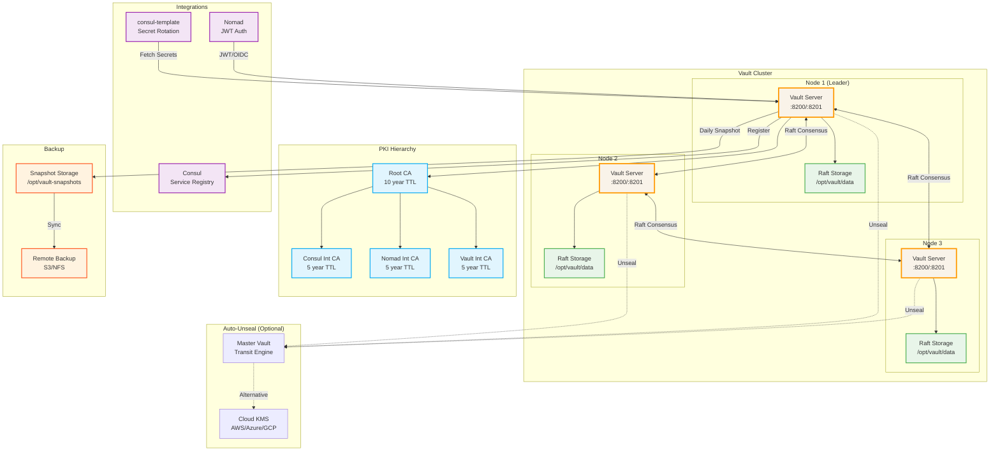
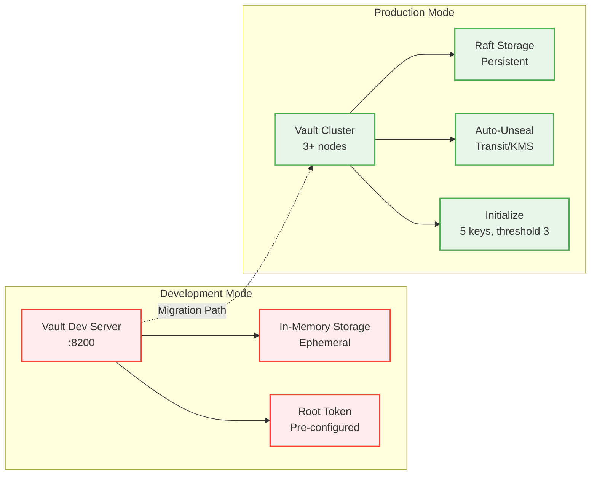
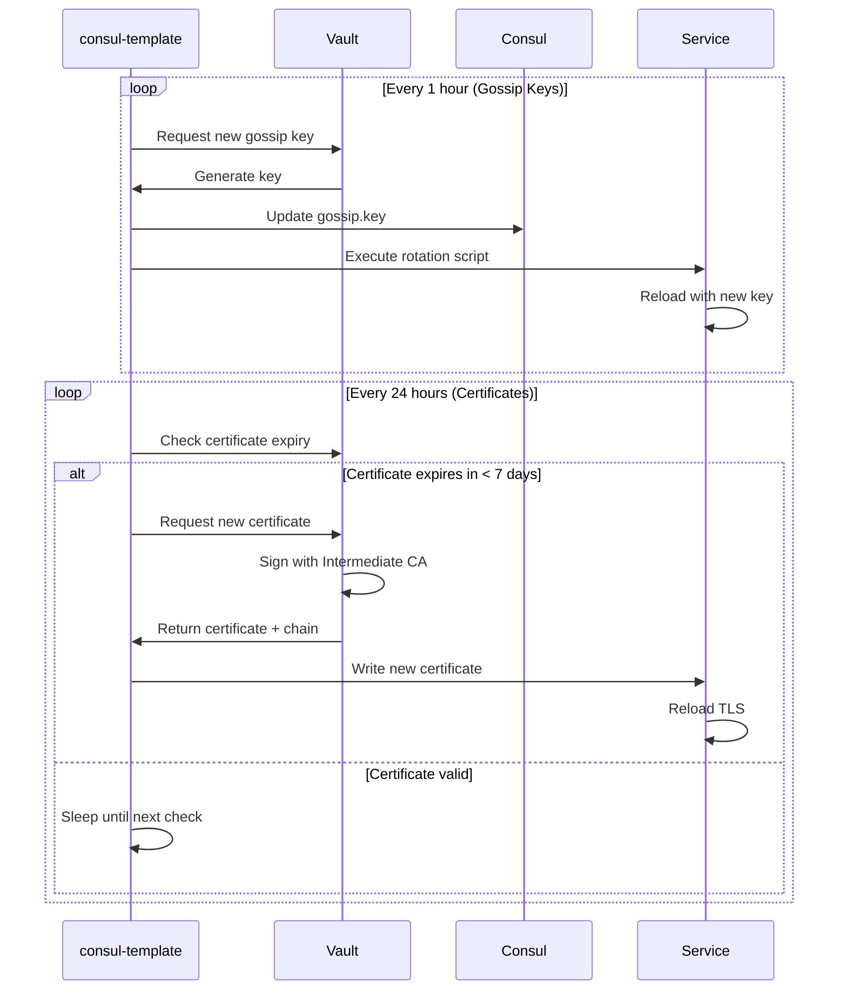
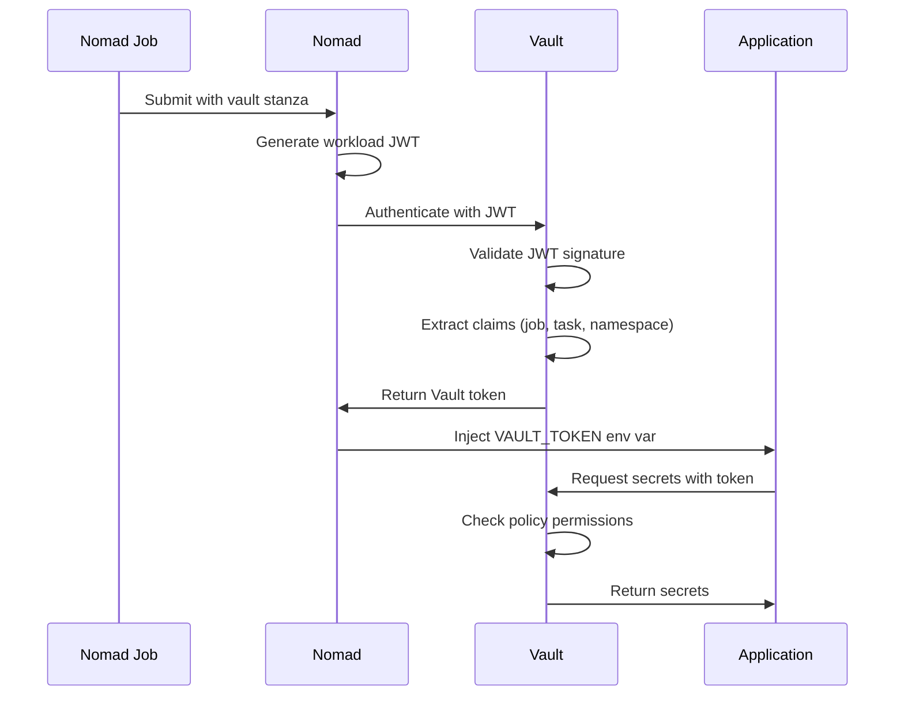

# Vault Architecture Diagram

This diagram shows the complete HashiCorp Vault deployment architecture including storage, unsealing, and integrations.

## Vault Deployment Architecture

## Development vs Production Modes

## Secret Rotation Flow

## Nomad Workload Identity Flow

## Key Features

### Storage Backend

- **Raft**: Integrated storage, no external dependencies
- **Consensus**: Automatic leader election and failover
- **Persistence**: Data stored in `/opt/vault/data`

### High Availability

- **3-node cluster**: Tolerates 1 node failure
- **Auto-failover**: New leader elected automatically
- **Split-brain prevention**: Raft consensus protocol

### Security Layers

- **Auto-unseal**: No manual intervention required
- **PKI hierarchy**: Three-tier certificate management
- **Audit logging**: All operations logged
- **Policy enforcement**: Fine-grained access control

### Automation

- **consul-template**: Automatic secret rotation
- **Snapshots**: Daily automated backups
- **Certificate renewal**: Before expiry
- **Token management**: Short-lived, auto-renewed
