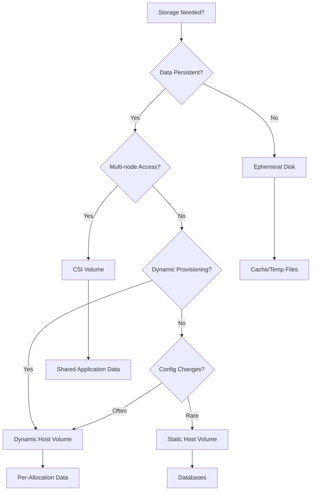

# Nomad Storage Strategy

This document provides a comprehensive strategy for storage management in Nomad, including decision criteria, implementation patterns, and migration paths.

## Overview

Nomad provides four distinct storage types, each optimized for different use cases:

1. **Ephemeral Disk** - Temporary storage in `/alloc/data`
2. **Static Host Volumes** - Pre-configured volumes on Nomad clients
3. **Dynamic Host Volumes** - On-demand provisioned volumes
4. **CSI Volumes** - Plugin-based storage with advanced features

## Storage Type Comparison

| Feature | Ephemeral | Static Host | Dynamic Host | CSI |
|---------|-----------|-------------|--------------|-----|
| **Persistence** | Until alloc stops | Permanent | Permanent | Permanent |
| **Multi-node Access** | No | No | No | Yes* |
| **Dynamic Provisioning** | N/A | No | Yes | Yes |
| **Snapshots/Cloning** | No | No | No | Yes |
| **Performance** | Fastest | Fast | Fast | Varies |
| **Configuration** | None | Agent config | Plugin script | Plugin job |
| **Use Case** | Cache, temp | Databases | Per-alloc data | Shared storage |

*Depends on CSI driver capabilities

## Decision Matrix

### When to Use Each Storage Type



## Storage Patterns by Use Case

### 1. Ephemeral Disk

**Best For:**
- Application caches
- Temporary build artifacts
- Log files (before shipping)
- Session data
- Scratch space

**Configuration:**
```hcl
task "cache-service" {
  driver = "docker"
  
  config {
    image = "redis:alpine"
  }
  
  ephemeral_disk {
    size    = 1024  # MB
    migrate = false # Don't preserve on reschedule
    sticky  = false # Don't preserve on update
  }
}
```

**Characteristics:**
- Automatically cleaned up
- No persistence guarantees
- Fastest performance (local disk)
- No configuration needed

### 2. Static Host Volumes

**Current Implementation:**
- PowerDNS MySQL data
- Traefik certificates

**Best For:**
- Database storage
- Certificate storage
- Application state (single-node)
- Development environments

**Client Configuration:**
```hcl
client {
  host_volume "powerdns-mysql" {
    path      = "/opt/nomad/volumes/powerdns-mysql"
    read_only = false
  }
  
  host_volume "traefik-certs" {
    path      = "/opt/nomad/volumes/traefik-certs"
    read_only = false
  }
}
```

**Job Configuration:**
```hcl
group "database" {
  volume "data" {
    type      = "host"
    source    = "powerdns-mysql"
    read_only = false
  }
  
  task "mysql" {
    volume_mount {
      volume      = "data"
      destination = "/var/lib/mysql"
    }
  }
}
```

**Provisioning Playbook:**
```yaml
# playbooks/infrastructure/nomad/volumes/provision-host-volumes.yml
---
- name: Provision Nomad host volumes
  hosts: tag_client
  become: true
  
  vars:
    nomad_volumes_base: /opt/nomad/volumes
    volumes:
      - name: powerdns-mysql
        owner: 999
        group: 999
      - name: traefik-certs
        owner: root
        group: root
      - name: prometheus-data
        owner: 65534
        group: 65534
  
  tasks:
    - name: Create volumes directory
      file:
        path: "{{ nomad_volumes_base }}"
        state: directory
        mode: '0755'
    
    - name: Create volume directories
      file:
        path: "{{ nomad_volumes_base }}/{{ item.name }}"
        state: directory
        owner: "{{ item.owner }}"
        group: "{{ item.group }}"
        mode: '0755'
      loop: "{{ volumes }}"
```

### 3. Dynamic Host Volumes

**Best For:**
- Per-allocation persistent data
- Dynamic workloads
- Prometheus/metrics storage
- User home directories

**Client Configuration:**
```hcl
client {
  host_volume "dynamic-data" {
    path = "/opt/nomad/volumes/dynamic"
    
    # Dynamic volume configuration
    dynamic = true
    
    # Plugin script for provisioning
    plugin = "ext4-volume"
  }
}
```

**Plugin Script Example:**
```bash
#!/bin/bash
# /opt/nomad/plugins/ext4-volume

case "$1" in
  create)
    VOLUME_ID="$2"
    SIZE_GB="$3"
    
    # Create sparse file
    truncate -s "${SIZE_GB}G" "/opt/nomad/volumes/dynamic/${VOLUME_ID}.img"
    
    # Create filesystem
    mkfs.ext4 -F "/opt/nomad/volumes/dynamic/${VOLUME_ID}.img"
    
    # Create mount point
    mkdir -p "/opt/nomad/volumes/dynamic/${VOLUME_ID}"
    
    # Mount
    mount -o loop "/opt/nomad/volumes/dynamic/${VOLUME_ID}.img" \
          "/opt/nomad/volumes/dynamic/${VOLUME_ID}"
    
    echo "/opt/nomad/volumes/dynamic/${VOLUME_ID}"
    ;;
    
  delete)
    VOLUME_ID="$2"
    umount "/opt/nomad/volumes/dynamic/${VOLUME_ID}"
    rm -rf "/opt/nomad/volumes/dynamic/${VOLUME_ID}"
    rm -f "/opt/nomad/volumes/dynamic/${VOLUME_ID}.img"
    ;;
esac
```

### 4. CSI Volumes

**Best For:**
- Multi-node shared storage
- High availability requirements
- Advanced features (snapshots, cloning)
- Cloud storage integration

**CSI Driver Options:**

#### NFS CSI Driver
```hcl
job "nfs-csi-plugin" {
  datacenters = ["dc1"]
  type        = "system"
  
  group "plugin" {
    task "plugin" {
      driver = "docker"
      
      config {
        image = "k8s.gcr.io/sig-storage/nfsplugin:v4.1.0"
        
        args = [
          "--v=5",
          "--nodeid=${node.unique.id}",
          "--endpoint=unix:///csi/csi.sock"
        ]
        
        privileged = true
      }
      
      csi_plugin {
        id        = "nfs"
        type      = "monolith"
        mount_dir = "/csi"
      }
    }
  }
}
```

**Volume Registration:**
```hcl
type         = "csi"
id           = "shared-data"
name         = "shared-data"
plugin_id    = "nfs"

capacity_min = "10GiB"
capacity_max = "100GiB"

capability {
  access_mode     = "multi-node-multi-writer"
  attachment_mode = "file-system"
}

parameters {
  server = "nfs.example.com"
  share  = "/exports/nomad"
}
```

## Volume Naming Conventions

### Static Host Volumes
Format: `{service}-{type}`
- `powerdns-mysql`
- `traefik-certs`
- `prometheus-data`

### Dynamic Host Volumes
Format: `{service}-{type}-{alloc_id}`
- `prometheus-data-${NOMAD_ALLOC_ID}`
- `elasticsearch-index-${NOMAD_ALLOC_ID}`

### CSI Volumes
Format: `{service}-{type}-{environment}`
- `gitlab-data-production`
- `nextcloud-files-staging`

## Migration Strategies

### From Static to Dynamic Host Volumes

1. **Assess Current Usage**
   ```bash
   # List all static volumes in use
   nomad node status -verbose | grep host_volume
   ```

2. **Create Migration Job**
   ```hcl
   job "migrate-volume" {
     type = "batch"
     
     task "migrate" {
       driver = "raw_exec"
       
       config {
         command = "/opt/nomad/scripts/migrate-volume.sh"
         args    = ["${old_volume}", "${new_volume}"]
       }
     }
   }
   ```

3. **Update Job Specifications**
   - Change volume type from `host` to CSI or dynamic
   - Update mount paths if needed

### From Host Volumes to CSI

1. **Deploy CSI Driver**
2. **Create CSI Volume**
3. **Stop Application**
4. **Copy Data**
5. **Update Job to Use CSI**
6. **Start Application**

## Backup Strategies

### Host Volumes
```yaml
# playbooks/infrastructure/nomad/volumes/backup-volumes.yml
---
- name: Backup Nomad host volumes
  hosts: tag_client
  
  tasks:
    - name: Create backup
      archive:
        path: /opt/nomad/volumes/{{ volume_name }}
        dest: /backup/nomad/{{ volume_name }}-{{ ansible_date_time.epoch }}.tar.gz
        format: gz
```

### CSI Volumes
- Use CSI driver snapshot capabilities
- Schedule regular snapshot jobs
- Test restore procedures

## Monitoring and Alerts

### Key Metrics
1. **Disk Usage**
   ```promql
   node_filesystem_avail_bytes{mountpoint=~"/opt/nomad/volumes/.*"} 
   / node_filesystem_size_bytes{mountpoint=~"/opt/nomad/volumes/.*"}
   ```

2. **Volume Health**
   - Mount status
   - I/O errors
   - Permission issues

3. **CSI Plugin Health**
   - Plugin availability
   - Volume attach/detach success rate

## Security Considerations

1. **Encryption**
   - Use LUKS for host volumes containing sensitive data
   - Enable encryption in CSI drivers where available

2. **Access Control**
   - Set appropriate file permissions
   - Use Nomad ACLs to control volume access
   - Implement SELinux/AppArmor policies

3. **Network Security**
   - Encrypt CSI plugin communication
   - Use dedicated storage network where possible

## Troubleshooting

### Common Issues

1. **Permission Denied**
   - Check volume ownership matches container user
   - Verify SELinux context if enabled

2. **Volume Not Found**
   - Ensure volume is defined in client config
   - Check volume name matches exactly

3. **CSI Mount Failed**
   - Verify CSI plugin is healthy
   - Check network connectivity to storage
   - Review plugin logs

### Debug Commands
```bash
# Check volume mounts
nomad alloc status -verbose <alloc-id> | grep -A5 "Volume"

# Inspect CSI plugin status
nomad plugin status <plugin-id>

# View CSI volume details
nomad volume status <volume-id>
```

## Future Considerations

1. **Multi-Region Storage**
   - Implement geo-replicated CSI solutions
   - Consider storage federation

2. **Performance Optimization**
   - SSD-backed host volumes for databases
   - NVMe for high-IOPS workloads

3. **Disaster Recovery**
   - Automated backup scheduling
   - Cross-region replication
   - Point-in-time recovery

## References

- [Nomad Volumes Documentation](https://www.nomadproject.io/docs/job-specification/volume)
- [CSI Specification](https://github.com/container-storage-interface/spec)
- [Nomad CSI Plugins](https://www.nomadproject.io/docs/job-specification/csi_plugin)