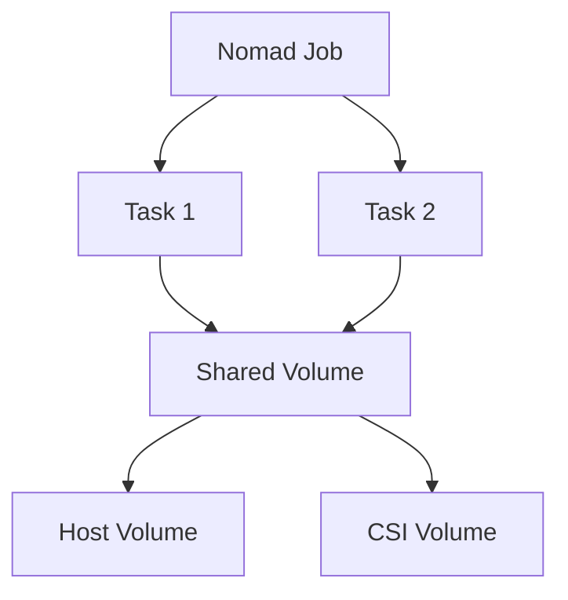
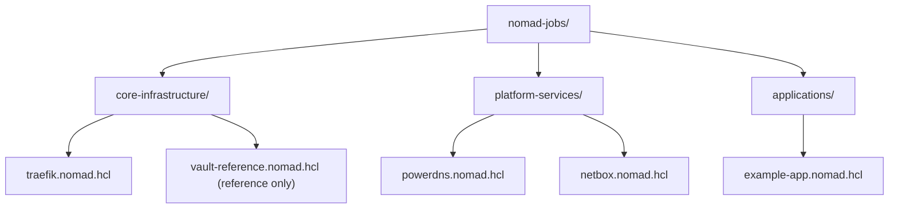

# Nomad Implementation Documentation

HashiCorp Nomad configuration and deployment patterns for container orchestration.

## Prerequisites

- Nomad 1.6+; Consul 1.16+; Vault 1.15+
- uv + Ansible installed (see `docs/getting-started/uv-ansible-notes.md`)
- Environment set for Nomad CLI:

```bash
export NOMAD_ADDR=http://nomad.service.consul:4646
```

### How these docs are organized

- [Storage Strategy](storage-strategy.md): decision criteria and architecture
- [Port Allocation](port-allocation.md): dynamic vs. static, patterns, validation
- [Dynamic Volumes](dynamic-volumes.md): plugin, systemd unit, installer, checks

## 📚 Documentation

### Storage Configuration

- **[storage-configuration.md](storage-configuration.md)** - Complete guide for Nomad job storage

  - Volume types and use cases
  - CSI plugin configuration
  - Host volume setup
  - Best practices and examples

- **[storage-strategy.md](storage-strategy.md)** - Strategic approach to Nomad storage

  - Storage architecture decisions
  - Data persistence patterns
  - Migration strategies
  - Performance considerations

- **[storage-patterns.md](storage-patterns.md)** - Common storage implementation patterns
  - Database storage patterns
  - Application data patterns
  - Shared storage patterns
  - Backup and recovery patterns

### Network Configuration

- **[port-allocation.md](port-allocation.md)** - Port allocation best practices
  - Dynamic vs static ports
  - Port range management
  - Service discovery integration
  - Load balancer configuration

## 🚀 Quick Start

### Deploy a Job

```bash
# Deploy a Nomad job
uv run ansible-playbook playbooks/infrastructure/nomad/deploy-job.yml \
  -i inventory/doggos-homelab/infisical.proxmox.yml \
  -e job=nomad-jobs/applications/example-app.nomad.hcl
```

### Check Job Status

```bash
# Set Nomad address
export NOMAD_ADDR=http://nomad.service.consul:4646

# List jobs
nomad job status

# Check specific job
nomad job status <job-name>
```

## 📋 Implementation Status

### ✅ Completed

- Port allocation strategy
- Storage configuration patterns
- Host volume documentation
- CSI plugin guidance
- **Consul ACL integration** (Aug 10, 2025) - KV access for job templating
- Enhanced Nomad role with automated ACL policy management

### 🚧 In Progress

- NFS CSI driver deployment
- Volume migration procedures

### ⏳ Planned

- Multi-region job patterns
- Advanced scheduling constraints
- Autoscaling configuration

## 🏗️ Architecture Overview

### Storage Architecture



### Port Allocation Strategy

- **Dynamic Ports** (20000-32000): Default for most services
- **Static Ports**: Only for:
  - DNS (53)
  - HTTP Load Balancer (80)
  - HTTPS Load Balancer (443)
  - Legacy services requiring specific ports

### Integration Points

- **Consul**: Service registration, health checks, and KV templating
- **Vault**: Dynamic secrets and workload identity
- **Traefik**: Load balancing and routing

### Consul KV Access for Jobs

Nomad jobs can access Consul's KV store for configuration templating:

```hcl
template {
  data = <<EOT
    database_host={{ key "app/database/host" }}
    database_port={{ key "app/database/port" }}
    api_key={{ with secret "secret/data/app" }}{{ .Data.data.api_key }}{{ end }}
  EOT
  destination = "local/config.env"
}
```

**Requirements**: Nomad agents must have proper Consul ACL permissions (`key_prefix` read access) - automatically configured by the enhanced Nomad role.

## 📁 Job Organization



## 🔑 Key Decisions

### Why Dynamic Ports?

- Avoids port conflicts
- Enables multiple instances
- Simplifies deployment
- Works with service discovery

### Why Host Volumes Initially?

- Simple to implement
- No additional infrastructure
- Good for single-node testing
- Clear migration path to CSI

### Why Separate Job Categories?

- Clear deployment priorities
- Different update strategies
- Distinct security policies
- Easier troubleshooting

## 📊 Storage Decision Matrix

| Storage Type | Use Case          | Persistence  | Performance | Complexity |
| ------------ | ----------------- | ------------ | ----------- | ---------- |
| Ephemeral    | Temp data, caches | None         | High        | Low        |
| Host Volume  | Single node apps  | Node-local   | High        | Low        |
| CSI Volume   | Distributed apps  | Cluster-wide | Medium      | Medium     |
| NFS          | Shared data       | Network      | Low-Medium  | Medium     |

## 🔧 Troubleshooting

### Common Issues

#### Job Fails to Start

```bash
# Check allocation status
nomad alloc status <alloc-id>

# View allocation logs
nomad alloc logs <alloc-id>

# Check constraints
nomad job plan <job.nomad>
```

#### Port Conflicts

```bash
# Find used ports
ss -tlnp | grep <port>

# Check Nomad allocations
nomad alloc status -json | jq '.TaskStates'
```

#### Volume Mount Issues

```bash
# Check host volume configuration
nomad node status -verbose <node-id>

# Verify permissions
ls -la /opt/nomad-volumes/
```

## 🛠️ Useful Commands

```bash
# Job Management
nomad job run <job.nomad>           # Deploy job
nomad job stop <job-name>           # Stop job
nomad job restart <job-name>        # Restart job

# Debugging
nomad alloc exec <alloc-id> /bin/sh # Shell into container
nomad alloc fs <alloc-id>           # Browse allocation filesystem
nomad alloc signal <alloc-id> HUP   # Send signal to task

# Monitoring
nomad node status                   # List nodes
nomad server members                # Show server cluster
nomad eval list                     # List evaluations
```

## 📚 Further Reading

- [Nomad Documentation](https://developer.hashicorp.com/nomad)
- [Nomad Storage](https://developer.hashicorp.com/nomad/docs/job-specification/volume)
- [Nomad Networking](https://developer.hashicorp.com/nomad/docs/job-specification/network)
- [Job Specification](https://developer.hashicorp.com/nomad/docs/job-specification)
