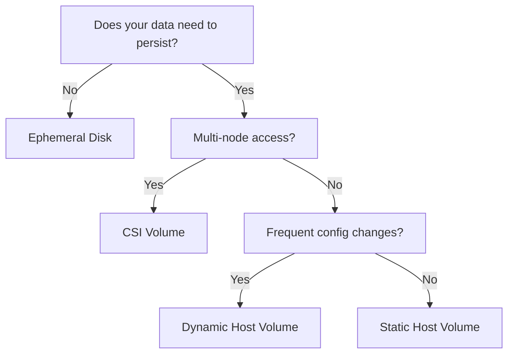

# Nomad Jobs Storage Configuration Guide

This guide provides storage configuration patterns for Nomad jobs, including naming conventions, lifecycle management, and practical examples.

## Storage Configuration Overview

Each Nomad job should clearly define its storage requirements:

1. **Data Persistence Needs** - Does data need to survive container restarts?
2. **Performance Requirements** - IOPS, throughput, latency needs
3. **Sharing Requirements** - Single node or multi-node access?
4. **Backup Requirements** - How critical is the data?

## Volume Naming Conventions

### Static Host Volumes

Format: `{service}-{type}`

Examples:

- `postgres-data` - PostgreSQL data directory
- `mysql-data` - MySQL/MariaDB data directory
- `traefik-certs` - Traefik SSL certificates
- `prometheus-data` - Prometheus metrics storage
- `grafana-config` - Grafana dashboards and settings

### Dynamic Host Volumes

Format: `{service}-{type}-${NOMAD_ALLOC_ID}`

The allocation ID is automatically appended for uniqueness.

### CSI Volumes

Format: `{service}-{type}-{environment}`

Examples:

- `gitlab-data-production`
- `nextcloud-files-staging`
- `minio-objects-development`

## Storage Type Selection Guide



## Encryption at Rest

- Host volumes: use LUKS for sensitive data and ensure systemd mounts are ready before jobs start.
- CSI volumes: prefer drivers that support native encryption; configure keys per driver guidance.

See also: [Security Considerations in Storage Strategy](./storage-strategy.md#security-considerations)

## Job Configuration Examples

### Example 1: Database with Static Host Volume

```hcl
job "postgres" {
  datacenters = ["dc1"]

  group "database" {
    # Define the volume
    volume "postgres-data" {
      type      = "host"
      source    = "postgres-data"  # Must match client config
      read_only = false
    }

    task "postgres" {
      driver = "docker"

      config {
        image = "postgres:15"
      }

      # Mount the volume
      volume_mount {
        volume      = "postgres-data"
        destination = "/var/lib/postgresql/data"
      }

      env {
        POSTGRES_PASSWORD = "{{ keyOrDefault \"postgres/password\" \"\" }}"
      }
    }
  }
}
```

### Example 2: Web App with Ephemeral Cache

```hcl
job "webapp" {
  datacenters = ["dc1"]

  group "app" {
    task "webapp" {
      driver = "docker"

      config {
        image = "myapp:latest"
      }

      # Ephemeral disk for cache
      ephemeral_disk {
        size    = 1024  # MB
        migrate = false # Don't preserve on reschedule
        sticky  = false # Clean cache on updates
      }

      env {
        CACHE_DIR = "/alloc/data/cache"
        TEMP_DIR  = "/alloc/data/tmp"
      }
    }
  }
}
```

### Example 3: Shared Storage with CSI

```hcl
job "shared-app" {
  datacenters = ["dc1"]

  group "app" {
    count = 3  # Multiple instances

    # CSI volume for shared data
    volume "shared-data" {
      type      = "csi"
      source    = "app-shared-data"
      read_only = false

      attachment_mode = "file-system"
      access_mode     = "multi-node-multi-writer"
    }

    task "app" {
      driver = "docker"

      config {
        image = "myapp:latest"
      }

      volume_mount {
        volume      = "shared-data"
        destination = "/data"
      }
    }
  }
}
```

## Volume Lifecycle Management

### Ownership and Permissions

Ensure host volume ownership matches the container user IDs used by your images:

| Service  | Default UID:GID | Path inside container    |
| -------- | --------------- | ------------------------ |
| Postgres | 999:999         | /var/lib/postgresql/data |
| MySQL    | 999:999         | /var/lib/mysql           |
| Netdata  | 201:201         | /etc/netdata             |
| Traefik  | 0:0             | /data/certs              |

Note: Verify actual IDs for your images and adjust Ansible provisioning accordingly.

### Pre-deployment Checklist

1. **For Static Host Volumes:**

   - [ ] Volume directory created on all potential nodes
   - [ ] Correct ownership/permissions set
   - [ ] Added to Nomad client configuration
   - [ ] Nomad clients restarted

2. **For CSI Volumes:**
   - [ ] CSI plugin deployed and healthy
   - [ ] Volume created and registered
   - [ ] Access permissions configured
   - [ ] Attachment mode verified

### Volume Provisioning Commands

```bash
# Create static host volume
ansible-playbook playbooks/infrastructure/nomad/volumes/provision-host-volumes.yml \
  -e volume_name=myapp-data \
  -e volume_owner=1000 \
  -e volume_group=1000

# Register CSI volume
nomad volume create myapp-volume.hcl

# Check volume status
nomad volume status myapp-data
```

### Backup Procedures

```bash
# Backup host volume
nomad job dispatch backup-volume \
  -meta volume_path=/opt/nomad/volumes/myapp-data \
  -meta backup_name=myapp-data-$(date +%Y%m%d)

# Backup CSI volume using snapshot
nomad volume snapshot create \
  -volume myapp-data \
  snapshot-$(date +%Y%m%d)
```

## Common Patterns

### Pattern 1: Database + Backup Sidecar

```hcl
group "database" {
  volume "data" {
    type   = "host"
    source = "mysql-data"
  }

  volume "backup" {
    type   = "host"
    source = "mysql-backup"
  }

  task "mysql" {
    volume_mount {
      volume      = "data"
      destination = "/var/lib/mysql"
    }
  }

  task "backup" {
    volume_mount {
      volume      = "backup"
      destination = "/backup"
    }

    # Runs periodic backups
  }
}
```

### Pattern 2: Multi-tier Storage

```hcl
group "app" {
  # Fast SSD for database
  volume "db" {
    type   = "host"
    source = "app-db-ssd"
  }

  # Large HDD for files
  volume "files" {
    type   = "csi"
    source = "app-files-hdd"
  }

  # Ephemeral for cache
  ephemeral_disk {
    size = 2048
  }
}
```

### Pattern 3: Blue-Green Deployment with Shared Storage

```hcl
job "app-blue" {
  group "app" {
    volume "shared" {
      type   = "csi"
      source = "app-shared-data"

      # Both blue and green access same data
  attachment_mode = "file-system"
      access_mode = "multi-node-multi-writer"
    }
  }
}

job "app-green" {
  group "app" {
    volume "shared" {
      type   = "csi"
      source = "app-shared-data"

  attachment_mode = "file-system"
      access_mode = "multi-node-multi-writer"
    }
  }
}
```

## Troubleshooting

### Volume Mount Issues

```bash
# Check allocation details
nomad alloc status -verbose <alloc-id>

# Inspect volume mounts
nomad alloc exec <alloc-id> df -h

# Check permissions
nomad alloc exec <alloc-id> ls -la /mount/point
```

### Performance Issues

```bash
# Monitor I/O
nomad alloc exec <alloc-id> iostat -x 1

# Check disk usage
nomad alloc exec <alloc-id> du -sh /mount/point/*
```

### CSI Problems

```bash
# Plugin status
nomad plugin status

# Volume details
nomad volume status <volume-id>

# Node eligibility
nomad node status -verbose
```

## Best Practices

1. **Always Define Storage Requirements**

   - Document why each volume is needed
   - Specify size requirements
   - Note performance needs

2. **Use Appropriate Storage Types**
   - Don't use CSI for single-node apps
   - Don't use ephemeral for persistent data
   - Consider performance vs cost

- For hot I/O paths (e.g., databases), tag SSD/NVMe nodes (e.g., node.meta.storage=nvme) and add a job constraint to target them

3. **Implement Backup Strategies**

   - Regular automated backups
   - Test restore procedures
   - Off-site backup for critical data

4. **Monitor Storage Health**

   - Disk usage alerts
   - I/O performance metrics
   - Volume availability checks

5. **Plan for Growth**
   - Size volumes appropriately
   - Implement cleanup policies
   - Plan migration strategies

## Migration Guide

### From Docker Volumes to Nomad Volumes

```hcl
# Before (Docker volume)
config {
  image = "mysql:8.0"
  volumes = [
    "mysql-data:/var/lib/mysql"
  ]
}

# After (Nomad volume)
volume "mysql-data" {
  type   = "host"
  source = "mysql-data"
}

task "mysql" {
  volume_mount {
    volume      = "mysql-data"
    destination = "/var/lib/mysql"
  }
}
```

### From Static to Dynamic Volumes

1. Stop the job
2. Copy data to new location
3. Update job specification
4. Start job with new volume

Note on dynamic host volumes:

- Ensure Nomad client is configured with `host_volume { dynamic = true; plugin = "ext4-volume" }` (see `roles/nomad/templates/client-dynamic-volume.hcl.example.j2`).
- Request size in the `volume_mount { size = "<GiB>" }` where supported (Nomad 1.6+).
- Use the provided systemd template to remount volumes on boot (see `roles/nomad/files/nomad-dynvol@.service` and the guide in `./dynamic-volumes.md`).

## Related Documentation

- [Nomad Storage Strategy](./storage-strategy.md)
- [Storage Implementation Patterns](./storage-patterns.md)
- [Volume Provisioning Playbooks](../../../playbooks/infrastructure/nomad/volumes/)
