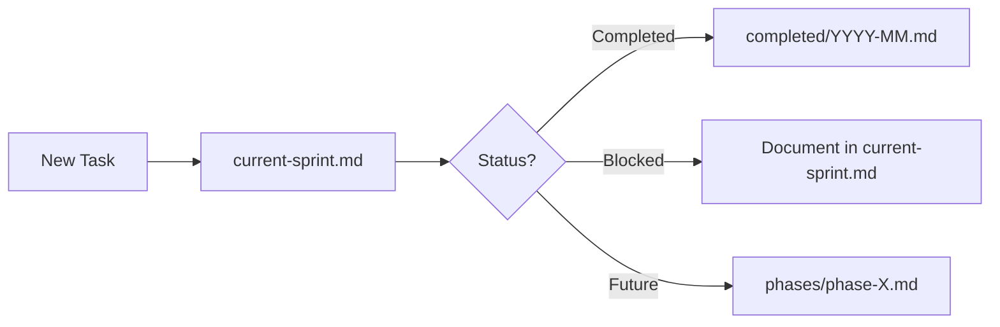

# Project Management Directory

This directory contains all project tracking documentation for the andromeda-orchestration project, organized for efficient navigation and minimal LLM context usage.

## 🗺️ Navigation Guide

### For Daily Work

- **[current-sprint.md](./current-sprint.md)** - What's being worked on RIGHT NOW (< 100 lines)
- **[task-summary.md](./task-summary.md)** - High-level project overview with progress metrics

### For Planning

- **[phases/](./phases/)** - Future phase planning documents
  - `phase-3-netbox.md` - NetBox integration and DNS migration
  - `phase-5-multisite.md` - Multi-site expansion and hardening
  - `phase-6-post-implementation-continuous-improvement.md` - Performance, automation, and maturity

### For History

- **[completed/](./completed/)** - Completed tasks organized by month
  - `2025-07.md` - July completions (Phase 0)
  - `2025-08.md` - August completions (Phases 1-2)
- **[archive/](./archive/)** - Historical snapshots
  - `full-task-list-2025-08-05.md` - Original 700+ line task list

## 📋 Quick Start

1. **Check current work**: Open [current-sprint.md](./current-sprint.md)
2. **Update task status**: Edit the appropriate file
3. **Plan next sprint**: Review [task-summary.md](./task-summary.md) and update priorities
4. **Archive completed work**: Move finished tasks to `completed/YYYY-MM.md`

## 🔄 Workflow



## 📏 File Size Guidelines

- **current-sprint.md**: Max 100 lines (optimal for LLM context)
- **task-summary.md**: Max 150 lines (overview only)
- **phase files**: Max 200 lines each
- **completed files**: No limit (archival)

## 🏷️ Task Format

All tasks follow this standard format:

```markdown
### [Number]. Task Title

**Description**: Clear, actionable description
**Status**: Not Started | In Progress | Completed | Blocked
**Priority**: Critical | High | Medium | Low
**Blockers**: None | Specific issues
**Related**: Links to docs

Tasks:

- [ ] Subtask 1
- [ ] Subtask 2
```

## 📊 Progress Tracking

Use these commands to track progress:

```bash
# Count tasks in current sprint
grep -c "^###" current-sprint.md

# Find blocked items
grep -A3 "Blocked" current-sprint.md

# Count completed this month
grep -c "✅" completed/2025-08.md
```

## 🔗 Related Documentation

- [Project Management Standards](../standards/project-management-standards.md)
- [DNS/IPAM Implementation Plan](../implementation/dns-ipam/implementation-plan.md)
- [Repository Structure](../getting-started/repository-structure.md)

## 🧭 Phases Legend

- **Phase 3: NetBox Integration and DNS Migration** — Integrate NetBox as source of truth; prep DNS migration
- **Phase 4: PowerDNS-NetBox Integration** — Configure zones, API integration, synchronization
- **Phase 5: Multi-Site Expansion and Optimization** — Extend to multiple sites; hardening and HA
- **Phase 6: Post-Implementation & Continuous Improvement** — Operations, automation, and maturity

See: [Phases Index](./phases/README.md)

## 🔖 Status Icons Legend

- ✅ Completed
- 🚧 In Progress
- ⏳ Not Started
- ⛔ Blocked
