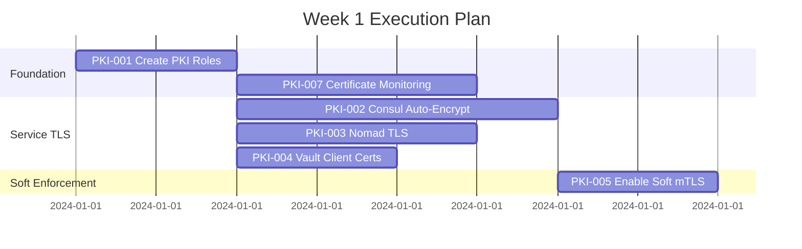
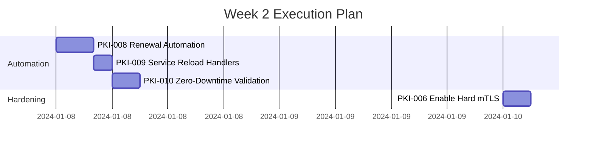
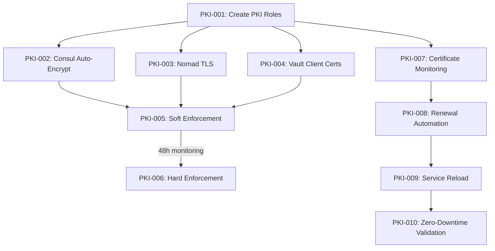

# PKI Infrastructure Task Breakdown

This directory contains the detailed task breakdown for implementing the Vault PKI Infrastructure (Issues #98 and #100).

## Task Overview

### Phase 1: mTLS Implementation (Issue #98)

| Task ID | Title                                                                          | Priority | Duration | Dependencies    | Status      |
| ------- | ------------------------------------------------------------------------------ | -------- | -------- | --------------- | ----------- |
| PKI-001 | [Create Service PKI Roles](pki-001-create-service-pki-roles.md)                | P0       | 2h       | None            | ✅ Complete |
| PKI-002 | [Configure Consul Auto-Encrypt](pki-002-configure-consul-auto-encrypt.md)      | P0       | 4h       | PKI-001         | 🔄 Ready    |
| PKI-003 | [Configure Nomad TLS](pki-003-configure-nomad-tls.md)                          | P0       | 3h       | PKI-001         | 🔄 Ready    |
| PKI-004 | [Configure Vault Client Certificates](pki-004-configure-vault-client-certs.md) | P1       | 2h       | PKI-001         | 🔄 Ready    |
| PKI-005 | [Enable mTLS Soft Enforcement](pki-005-enable-mtls-soft-enforcement.md)        | P0       | 2h       | PKI-002,003,004 | 🔄 Ready    |
| PKI-006 | [Enable mTLS Hard Enforcement](pki-006-enable-mtls-hard-enforcement.md)        | P0       | 3h       | PKI-005 (+48h)  | ⏸️ Blocked  |

**Total Phase 1 Duration**: ~16 hours active work + 48 hours monitoring

### Phase 2: Certificate Rotation Automation (Issue #100)

| Task ID | Title                                                                           | Priority | Duration | Dependencies    | Status   |
| ------- | ------------------------------------------------------------------------------- | -------- | -------- | --------------- | -------- |
| PKI-007 | [Implement Certificate Monitoring](pki-007-implement-certificate-monitoring.md) | P0       | 3h       | PKI-001         | 🔄 Ready |
| PKI-008 | [Certificate Renewal Automation](pki-008-certificate-renewal-automation.md)     | P0       | 4h       | PKI-007         | 🔄 Ready |
| PKI-009 | [Service Reload Handlers](pki-009-service-reload-handlers.md)                   | P0       | 2h       | PKI-008         | 🔄 Ready |
| PKI-010 | [Zero-Downtime Validation](pki-010-zero-downtime-validation.md)                 | P0       | 3h       | PKI-007,008,009 | 🔄 Ready |

**Total Phase 2 Duration**: ~12 hours active work

### Phase 3: Advanced PKI Features

| Task ID | Title                                                                                         | Priority | Duration | Dependencies    | Status   |
| ------- | --------------------------------------------------------------------------------------------- | -------- | -------- | --------------- | -------- |
| PKI-011 | [Configure Certificate Distribution to Nomad Jobs](pki-011-certificate-distribution-nomad.md) | P0       | 4h       | PKI-001,PKI-003 | 🔄 Ready |
| PKI-012 | [Enable Consul Connect Service Mesh](pki-012-consul-connect-service-mesh.md)                  | P0       | 4h       | PKI-001,PKI-002 | 🔄 Ready |
| PKI-013 | [Implement Certificate Revocation](pki-013-certificate-revocation-infrastructure.md)          | P1       | 3h       | PKI-001,PKI-007 | 🔄 Ready |
| PKI-014 | [Configure Advanced PKI Monitoring](pki-014-advanced-pki-monitoring.md)                       | P1       | 3h       | PKI-007,PKI-013 | 🔄 Ready |
| PKI-015 | [Implement PKI Disaster Recovery](pki-015-pki-disaster-recovery.md)                           | P0       | 4h       | PKI-001-006     | 🔄 Ready |
| PKI-016 | [Optimize TLS Performance](pki-016-tls-performance-optimization.md)                           | P2       | 2h       | PKI-001-006     | 🔄 Ready |

**Total Phase 3 Duration**: ~20 hours active work

## Execution Strategy

### Week 1: Foundation & mTLS Setup

**Goal**: Establish PKI roles and enable TLS across all services



### Week 2: Automation & Hardening

**Goal**: Implement certificate rotation and enable strict mTLS



## Task Relationships



## Critical Path

The critical path for completion:

1. **PKI-001** → **PKI-002/003/004** (parallel) → **PKI-005** → **PKI-006**
2. **PKI-007** → **PKI-008** → **PKI-009** → **PKI-010**

Both paths can run in parallel after PKI-001 is complete.

## Risk Mitigation

| Risk                                      | Impact   | Mitigation                               | Owner  |
| ----------------------------------------- | -------- | ---------------------------------------- | ------ |
| Service disruption during mTLS enablement | High     | Soft enforcement period with monitoring  | DevOps |
| Certificate expiry causing outages        | Critical | Automated renewal 30 days before expiry  | System |
| Failed certificate rotation               | High     | Backup certificates, rollback procedures | DevOps |
| Performance impact from TLS               | Medium   | Monitor latency, optimize cipher suites  | DevOps |

## Success Metrics

- ✅ **mTLS Coverage**: 100% of inter-service communication encrypted
- ✅ **Certificate Validity**: No certificates expire unexpectedly
- ✅ **Automation Rate**: 100% of certificate renewals automated
- ✅ **Availability**: 99.9%+ uptime during certificate rotations
- ✅ **Security Posture**: Zero non-TLS connections accepted

## Quick Start Commands

```bash
# Start with PKI role creation
ansible-playbook playbooks/infrastructure/vault/create-service-pki-roles.yml

# Enable certificate monitoring
ansible-playbook playbooks/infrastructure/vault/deploy-cert-monitoring.yml

# Test certificate renewal (dry-run)
ansible-playbook playbooks/infrastructure/vault/renew-certificates.yml --check

# Validate zero-downtime rotation
ansible-playbook playbooks/infrastructure/vault/validate-zero-downtime.yml
```

## Reference Documentation

- [Vault PKI Secret Engine](https://developer.hashicorp.com/vault/docs/secrets/pki)
- [Consul Auto-Encrypt](https://developer.hashicorp.com/consul/docs/agent/config/auto-encrypt)
- [Nomad TLS Configuration](https://developer.hashicorp.com/nomad/docs/configuration/tls)
- [Ansible Research Report](../../../.claude/research-reports/ansible-pki-research-20250912-003533.md)

## Task Status Legend

- 🔄 **Ready**: Task can be started immediately
- ⏸️ **Blocked**: Waiting on dependencies
- 🚧 **In Progress**: Currently being worked on
- ✅ **Complete**: Task finished and validated
- ❌ **Failed**: Task encountered issues
