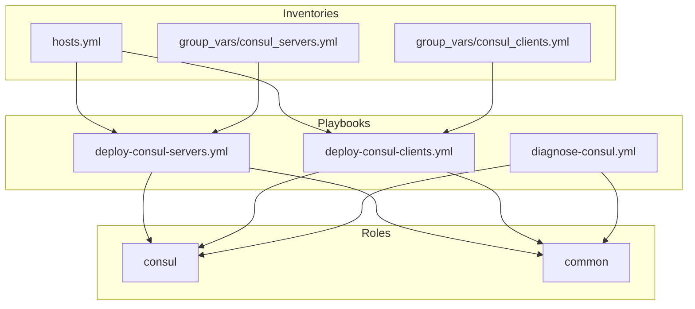

# Consul Role

This Ansible role manages HashiCorp Consul installation and configuration in a cluster with dual network interfaces.

## Variables

### `consul_version`

- **Purpose**: Specifies the version of Consul to install.
- **Default Value**: `latest`
- **Example**:

  ```yaml
  consul_version: 1.11.4
  ```

### `consul_config`

- **Purpose**: Configuration settings for Consul.
- **Default Value**: `{}` (empty dictionary)
- **Example**:

  ```yaml
  consul_config:
    data_dir: /opt/consul
    bind_addr: 0.0.0.0
  ```

## Architecture Overview

The Consul cluster is configured with two network interfaces:

- **Management Network (eth0)**: Used for general access and API endpoints.
- **High-Speed Network (eth1)**: Used for inter-node traffic, improving performance for node-to-node communication.

### Network Layout

#### Servers

| Host            | Management IP (eth0) | High-Speed IP (eth1) |
| --------------- | -------------------- | -------------------- |
| consul-server-1 | 192.168.10.11        | 192.168.11.11        |
| consul-server-2 | 192.168.10.12        | 192.168.11.12        |
| consul-server-3 | 192.168.10.13        | 192.168.11.13        |

#### Clients

| Host            | Management IP (eth0) | High-Speed IP (eth1) |
| --------------- | -------------------- | -------------------- |
| consul-client-1 | 192.168.10.20        | 192.168.11.20        |
| consul-client-2 | 192.168.10.21        | 192.168.11.21        |
| consul-client-3 | 192.168.10.22        | 192.168.11.22        |

## Service Ports

| Service         | Port | Description                                         |
| --------------- | ---- | --------------------------------------------------- |
| Consul HTTP API | 8500 | The HTTP API port for API access and web UI         |
| Consul DNS      | 8600 | Used for DNS interface                              |
| Consul RPC      | 8300 | The RPC port for server-to-server communication     |
| Consul LAN Serf | 8301 | LAN gossip protocol for client-server communication |
| Consul WAN Serf | 8302 | WAN gossip protocol between datacenters             |

## Role Variables

Important variables defined in `defaults/main.yml`:

```yaml
# Basic configuration
consul_data_dir: "/opt/consul/data" # Directory for Consul data
consul_log_level: "INFO" # Log verbosity level
consul_datacenter: "dc1" # Datacenter name for the Consul cluster

# Server configuration
consul_server_enabled: false # Enable Consul server mode
consul_bootstrap_expect: 3 # Number of servers to form a quorum
consul_server_retry_join: # List of server IPs for retry join
  - "192.168.11.11"
  - "192.168.11.12"
  - "192.168.11.13"

# Client configuration
consul_client_enabled: true # Enable Consul client mode
consul_client_servers: # List of server IPs for clients to connect to
  - "192.168.11.11"
  - "192.168.11.12"
  - "192.168.11.13"
consul_client_network_interface: "eth1" # Network interface for client communication

# Enable ACLs for access control
consul_acl_enabled: true
consul_acl_default_policy: "deny" # Default policy for unauthenticated requests
consul_acl_master_token: "master-token" # Master token for ACL management

# Enable TLS for secure communication
consul_tls_enabled: true
consul_tls_verify_incoming: true # Verify incoming connections
consul_tls_verify_outgoing: true # Verify outgoing connections
consul_tls_ca_file: "/etc/consul/ca.pem" # Path to CA certificate
consul_tls_cert_file: "/etc/consul/consul.pem" # Path to Consul certificate
consul_tls_key_file: "/etc/consul/consul-key.pem" # Path to Consul private key

# Enable gossip encryption
consul_encrypt: "your-encryption-key" # Encryption key for gossip protocol

# Consul version
consul_version: "1.20.5"
```

Override these defaults in host or group variables as needed.

## Dependencies

This role is a prerequisite for the `nomad` role. Ensure that Consul is installed and running before deploying Nomad servers or clients. The `provision.yml` playbook includes pre-tasks to handle this dependency automatically.

## Deployment Playbooks

### 1. Deploying Consul Servers

Use the `deploy-consul-servers.yml` playbook to deploy and configure Consul servers:

```bash
ansible-playbook playbooks/deploy-consul-servers.yml -e "consul_version=1.20.5"
```

This playbook:

- Installs Consul on the server nodes.
- Configures them for high-speed network communication.
- Sets up server clustering with proper retry_join settings.
- Validates that the number of servers matches `bootstrap_expect`.
- Enables the servers to form a quorum (bootstrap_expect: 3).

### 2. Deploying Consul Clients

Use the `deploy-consul-clients.yml` playbook to deploy and configure Consul clients:

```bash
ansible-playbook playbooks/deploy-consul-clients.yml -e "consul_version=1.20.5"
```

This playbook:

- Installs Consul on the client nodes.
- Configures them to connect to servers via the high-speed network.
- Sets client-specific settings.
- Validates TLS configuration if enabled.

## Architecture Diagram

Below is a flowchart illustrating the relationships between Consul playbooks, roles, and inventories:



## Configuration Templates

The role uses a single template `consul.hcl.j2` for both servers and clients, with conditional blocks based on role variables.

### TLS Validation

If `consul_tls_enabled` is set to `true`, the role validates the presence of the following files:

- `consul_tls_ca_file`: Path to the CA certificate.
- `consul_tls_cert_file`: Path to the Consul certificate.
- `consul_tls_key_file`: Path to the Consul private key.

The role will fail if any of these files are missing.

### Bootstrap Validation

The role validates that the number of servers in the inventory matches the `bootstrap_expect` value. This ensures that the cluster can form a quorum.

## Integration with Nomad

This Consul role is designed to work seamlessly with the Nomad role:

1. **Service Discovery**: Nomad jobs can use Consul for service registration and discovery.
2. **Shared Network Architecture**: Both roles use the same high-speed network for internal communication.
3. **ACL Token Sharing**: The `consul_acl_agent_token` is shared with Nomad for integration with a secured Consul cluster.

### Example Nomad Integration

In the Nomad configuration, include the Consul block:

```hcl
consul {
  address = "127.0.0.1:8500"
  token = "master-token"
}
```

For more details, refer to the [Nomad role documentation](../nomad-role/README.md). This ensures that Nomad can register services and perform service discovery in a secured Consul cluster.

## Security Considerations

The default configuration provides a basic security setup:

1. **Encryption**: All gossip communication is encrypted using the specified encrypt key.
2. **ACLs**: ACLs are enabled by default with a `deny` policy for unauthenticated requests.
3. **TLS**: TLS is enabled for secure communication.

For production deployments, ensure that:

- ACLs are properly configured with tokens for agents and services.
- TLS certificates are valid and properly distributed.
- Firewall rules allow only necessary ports.
- Rotate ACL tokens and encryption keys periodically to enhance security.

### ACL Bootstrapping Integration

The Consul role now automatically performs ACL bootstrapping and agent token distribution after Consul is installed and running. The separate `consul_acl_bootstrap` role is no longer required.

## Troubleshooting

If you encounter issues with your Consul deployment, the `diagnose-consul.yml` playbook can help identify problems:

```bash
ansible-playbook playbooks/diagnose-consul.yml
```

### Common Issues and Solutions

1. **Nodes Won't Join Cluster**

   - Check network connectivity between nodes on the high-speed network.
   - Verify that the encryption key is consistent across all nodes.
   - Ensure firewall rules allow Consul ports (8300-8302, 8500, 8600).

2. **Service Registration Issues**

   - Check file permissions on service definition files.
   - Verify that the service is running on the specified port.
   - Check Consul logs for registration errors: `journalctl -u consul`.

3. **Web UI Not Accessible**

   - Confirm that `consul_ui` is set to `true`.
   - Check if the client address is properly set to allow external connections.
   - Verify that port 8500 is accessible from your browser.

4. **Performance Issues**
   - Consider adjusting the `performance.raft_multiplier` value (lower for higher performance).
   - Verify that the high-speed network is being used for inter-node communication.
   - Monitor resource usage and consider increasing resources if needed.

## Testing the Role

After deploying the Consul role, verify the setup using the following steps:

1. **Check Cluster Members**:
   Run the following command on any Consul node to verify cluster membership:

   ```bash
   consul members
   ```

2. **Verify Service Registration**:
   Check the registered services in the Consul catalog:

   ```bash
   consul catalog services
   ```

3. **Check Service Health**:
   Verify the health of a specific service:

   ```bash
   consul health service <service-name>
   ```

4. **Access the Web UI**:
   Open the Consul web UI in your browser:
   `http://<management-ip>:8500`

5. **Run Diagnostics**:
   Use the `diagnose-consul.yml` playbook to collect diagnostic information:

   ```bash
   ansible-playbook playbooks/diagnose-consul.yml
   ```

6. **Test in Staging**:
   Always test configurations in a staging environment before applying them to production.

## Inventory Generation

To generate the inventory file for your Consul deployment, use the `generate_inventory.py` script located in the `scripts/` directory:

```bash
python scripts/generate_inventory.py
```

## This script helps create a dynamic inventory based on your network layout and host configurations

## Handlers

- **Restart consul**: Restarts the Consul service after configuration changes.
- **Reload consul**: Reloads Consul configuration.
- **Validate consul config**: Validates Consul configuration before restart.
- **Restart consul (if config is valid)**: Restarts Consul only if configuration validation passes.

---

## Idempotency, DRYness, and Best Practices

- All tasks are idempotent and safe to re-run.
- Variables are defined in `defaults/main.yml` for easy override.
- Handlers validate and restart Consul only when necessary.
- Role is modular and integrates with Nomad and other roles.
- Follows Ansible best practices for variable naming, handler usage, and documentation.

---
