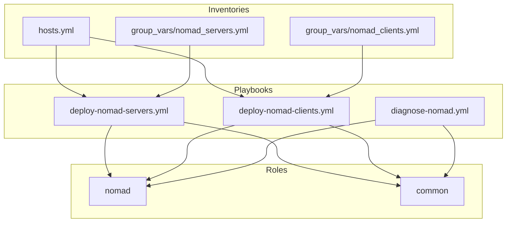

# Nomad Role

This role installs and configures HashiCorp Nomad.

## Dynamic Host Volumes

- Task: `tasks/dynamic-volumes.yml` installs the `ext4-volume` plugin to `/opt/nomad/plugins/` and the `nomad-dynvol@.service` unit.
- Client config example: `templates/client-dynamic-volume.hcl.example.j2`

After applying, copy the example to your Nomad client config and reload Nomad:

```sh
sudo cp roles/nomad/templates/client-dynamic-volume.hcl.example.j2 /etc/nomad.d/20-dynamic-volume.hcl
sudo systemctl reload nomad
```

See `docs/implementation/nomad/dynamic-volumes.md` for background and sanity checks.

# Nomad Role

This Ansible role manages HashiCorp Nomad installation and configuration in a cluster with dual network interfaces.

## Architecture Overview

The Nomad cluster is configured with two network interfaces:

- **Management Network (eth0)**: Used for general access and API endpoints.
- **High-Speed Network (eth1)**: Used for inter-node traffic, improving performance for node-to-node communication.

### Network Layout

#### Servers

| Host           | Management IP (eth0) | High-Speed IP (eth1) |
| -------------- | -------------------- | -------------------- |
| nomad-server-1 | 192.168.10.11        | 192.168.11.11        |
| nomad-server-2 | 192.168.10.12        | 192.168.11.12        |
| nomad-server-3 | 192.168.10.13        | 192.168.11.13        |

#### Clients

| Host           | Management IP (eth0) | High-Speed IP (eth1) |
| -------------- | -------------------- | -------------------- |
| nomad-client-1 | 192.168.10.20        | 192.168.11.20        |
| nomad-client-2 | 192.168.10.21        | 192.168.11.21        |
| nomad-client-3 | 192.168.10.22        | 192.168.11.22        |

## Service Ports

| Service        | Port | Description                                          |
| -------------- | ---- | ---------------------------------------------------- |
| Nomad HTTP API | 4646 | The HTTP API port for API access and web UI          |
| Nomad RPC      | 4647 | The RPC port for CLI and client/server communication |
| Nomad Serf WAN | 4648 | The Serf port for gossip protocol between servers    |

## Role Variables

Important variables defined in `defaults/main.yml`:

```yaml
# Basic configuration
nomad_data_dir: "/opt/nomad/data" # Directory for Nomad data
nomad_log_level: "INFO" # Log verbosity level

# Server configuration
nomad_server_enabled: false # Enable Nomad server mode
nomad_server_bootstrap_expect: 3 # Number of servers to form a quorum
nomad_server_retry_join: # List of server IPs for retry join
  - "192.168.11.11"
  - "192.168.11.12"
  - "192.168.11.13"

# Client configuration
nomad_client_enabled: false # Enable Nomad client mode
nomad_client_servers: # List of server IPs for clients to connect to
  - "192.168.11.11:4647"
  - "192.168.11.12:4647"
  - "192.168.11.13:4647"
nomad_client_network_interface: "eth1" # Network interface for client communication
nomad_client_volume_path: "/mnt/nomad-volumes" # Path for persistent storage

# Consul integration
nomad_consul_integration: true # Enable integration with Consul
nomad_consul_address: "127.0.0.1:8500" # Consul address
consul_acl_agent_token: "master-token" # Consul ACL token for Nomad

# Consul Service Mesh integration
nomad_consul_service_mesh: true # Enable Consul Service Mesh
cni_version: "1.6.2" # CNI plugins version
consul_cni_version: "1.6.3" # Consul CNI plugin version
cni_arch: "amd64" # CNI architecture

# TLS configuration
nomad_tls_enabled: true
nomad_tls_ca_file: "/etc/nomad/ca.pem" # Path to CA certificate
nomad_tls_cert_file: "/etc/nomad/nomad.pem" # Path to Nomad certificate
nomad_tls_key_file: "/etc/nomad/nomad-key.pem" # Path to Nomad private key

nomad_version: "1.10.0"
```

Override these defaults in host or group variables as needed.

## Deployment Playbooks

### 1. Deploying Nomad Servers

Use the `deploy-nomad-servers.yml` playbook to deploy and configure Nomad servers:

```bash
ansible-playbook playbooks/deploy-nomad-servers.yml -e "nomad_version=1.10.0"
```

This playbook:

- Installs Nomad on the server nodes.
- Configures them for high-speed network communication.
- Sets up server clustering with proper retry_join settings.
- Waits for Consul to be fully bootstrapped before starting Nomad.
- Enables the servers to form a quorum (bootstrap_expect: 3).

### 2. Deploying Nomad Clients

Use the `deploy-nomad-clients.yml` playbook to deploy and configure Nomad clients:

```bash
ansible-playbook playbooks/deploy-nomad-clients.yml -e "nomad_version=1.10.0"
```

This playbook:

- Installs Docker on the client nodes.
- Installs Nomad on the client nodes.
- Configures them to connect to servers via the high-speed network.
- Sets client-specific settings including `network_interface`.
- Enables the Docker driver for container workloads.
- Registers the clients with the server cluster.

### 3. Diagnostics

For troubleshooting, use the `diagnose-nomad.yml` playbook:

```bash
ansible-playbook playbooks/diagnose-nomad.yml
```

This playbook collects information about:

- Nomad service status.
- Network configuration.
- Server membership.
- Client registration status.

## Architecture Diagram

Below is a flowchart illustrating the relationships between Nomad playbooks, roles, and inventories:



## Configuration Templates

The role uses a single template `nomad.hcl.j2` for both servers and clients, with conditional blocks based on role variables.

### Key Features of the Template

1. **Dynamic Defaults**:

   - The `bootstrap_expect` value dynamically defaults to the number of servers in the cluster or `3` if not defined.
   - The `log_level` adjusts based on the `nomad_environment` variable (e.g., `DEBUG` for development).

2. **Error Handling**:

   - The template includes fallback values for critical variables like `servers` to avoid runtime errors.

3. **TLS Configuration**:

   - TLS is conditionally enabled with options for mutual TLS (`verify_https_client`) and hostname verification.

4. **Consul Integration**:

   - Consul integration is optional and includes support for tokens and auto-advertising.
   - Service Mesh features like service identity and task identity can be enabled for Consul Connect.

5. **CNI and Bridge Networking**:

   - CNI configuration for bridge networking and Consul Service Mesh
   - Bridge network mode with subnet configuration
   - Host network configuration for direct access to specific ports

6. **Docker Plugin**:
   - The Docker plugin is configured with `allow_privileged` and volume support for container workloads.

## Dependency on Consul

Nomad requires Consul for service discovery and cluster coordination. Ensure that:

1. Consul is fully bootstrapped before starting Nomad.
2. The `consul_acl_agent_token` is provided to Nomad for integration with a secured Consul cluster.

### Example Consul Integration

In the Nomad configuration, include the Consul block:

```hcl
consul {
  address = "127.0.0.1:8500"
  token = "master-token"
}
```

This ensures that Nomad can register services and perform service discovery in a secured Consul cluster.

## CNI and Bridge Networking

The Nomad role now includes Container Network Interface (CNI) support, which is required for bridge networking and Consul Service Mesh integration.

### What is CNI?

Container Network Interface (CNI) is a specification and set of plugins for configuring network interfaces in Linux containers. Nomad uses CNI plugins to set up networking for tasks, particularly for bridge networking mode.

### Components Installed

1. **Standard CNI Plugins**:

   - Installation path: `/opt/cni/bin/`
   - Includes: bridge, host-local, loopback, dhcp, etc.
   - Version: Configurable via `cni_version` (default: 1.6.2)

2. **CNI Configuration Directory**:
   - Path: `/etc/cni/net.d/`
   - Used by Nomad to find network configurations

### Implementation Details

The role sets up the following:

1. **Required Packages**:

   - bridge-utils: For bridge interface management
   - dmidecode: For system information gathering
   - iproute2: For advanced network configuration

2. **Kernel Parameters**:

   - `net.bridge.bridge-nf-call-arptables = 1`
   - `net.bridge.bridge-nf-call-iptables = 1`
   - `net.bridge.bridge-nf-call-ip6tables = 1`

3. **Nomad Configuration**:

   ```hcl
   # CNI configuration
   cni_path = "/opt/cni/bin"
   cni_config_dir = "/etc/cni/net.d"

   # Bridge network setup
   bridge_network_name = "nomad"
   bridge_network_subnet = "172.26.64.0/20"

   # Host network for direct access
   host_network "public" {
     cidr = "0.0.0.0/0"
     reserved_ports = "22,80,443"
   }
   ```

### Using Bridge Networking in Jobs

With CNI configured, you can use bridge networking in your Nomad jobs:

```hcl
job "example" {
  group "example" {
    network {
      mode = "bridge"

      port "http" {
        to = 80
      }
    }

    task "app" {
      driver = "docker"

      config {
        image = "nginx:alpine"
        ports = ["http"]
      }
    }
  }
}
```

This creates an isolated network namespace with its own IP address in the bridge network subnet.

### Fix Playbook for Existing Deployments

For existing Nomad clients, use the fix playbook to add CNI support:

```bash
ansible-playbook -i inventories/<environment>/hosts.yml playbooks/fix/fix-nomad-client-cni.yml
```

This playbook:

- Downloads and installs CNI plugins
- Creates required directories
- Updates the Nomad configuration
- Configures kernel parameters
- Restarts Nomad clients

### Consul Service Mesh Integration

When `nomad_consul_service_mesh` is enabled, the role:

1. Installs Container Network Interface (CNI) plugins (v1.6.2+)
2. Installs Consul CNI plugin (v1.6.3+)
3. Creates the CNI configuration directory (/etc/cni/net.d)
4. Configures bridge networking with proper subnet settings
5. Enables IP forwarding and bridge networking settings via sysctl
6. Configures the Nomad client with proper service mesh configuration

The Nomad configuration will include advanced Consul integration features:

```hcl
consul {
  address = "127.0.0.1:8500"
  token = "master-token"

  # Service Mesh functionality
  service_identity {
    # Enable automatic service identities for tasks
    auto = true
  }
  task_identity {
    # Enable identities for Consul task registration
    enabled = true
  }
}
```

#### Required Network Configuration

For Consul Service Mesh to function properly, the role configures:

1. Bridge network settings:

   ```hcl
   bridge_network_name = "nomad"
   bridge_network_subnet = "172.26.64.0/20"
   cni_path = "/opt/cni/bin"
   cni_config_dir = "/etc/cni/net.d"
   ```

2. Kernel parameters:
   ```
   net.bridge.bridge-nf-call-arptables = 1
   net.bridge.bridge-nf-call-iptables = 1
   net.ipv4.ip_forward = 1
   ```

These enable transparent proxying between services in the mesh.

For more details, refer to the [Consul Role Documentation](../consul/README.md).

## TLS Validation

If `nomad_tls_enabled` is set to `true`, the role validates the presence of the following files:

- `nomad_tls_ca_file`: Path to the CA certificate.
- `nomad_tls_cert_file`: Path to the Nomad certificate.
- `nomad_tls_key_file`: Path to the Nomad private key.

The role will fail if any of these files are missing.

## Example Host Inventory

The inventory should define both network interfaces for each host:

```yaml
all:
  children:
    nomad_clients:
      hosts:
        nomad-client-1:
          ansible_host: 192.168.10.20
          ansible_user: ansible
          inter_device_interface: 192.168.11.20
        # Additional clients...
    nomad_servers:
      hosts:
        nomad-server-1:
          ansible_host: 192.168.10.11
          ansible_user: ansible
          inter_device_interface: 192.168.11.11
        # Additional servers...
```

Dynamic inventory scripts can be used for environments with frequently changing infrastructure.

## Testing the Role

After deploying the Nomad role, verify the setup using the following steps:

1. **Check Cluster Members**:
   Run the following command on any Nomad server to verify cluster membership:

   ```bash
   nomad server members
   ```

2. **Verify Service Registration**:
   Check the registered services in the Consul catalog:

   ```bash
   consul catalog services
   ```

3. **Check Job Status**:
   Verify the status of a specific job:

   ```bash
   nomad job status <job-name>
   ```

4. **Access the Web UI**:
   Open the Nomad web UI in your browser:
   `http://<management-ip>:4646`

5. **Run Diagnostics**:
   Use the `diagnose-nomad.yml` playbook to collect diagnostic information:

   ```bash
   ansible-playbook playbooks/diagnose-nomad.yml
   ```

6. **Test in Staging**:
   Test Nomad jobs in a staging environment before deploying them to production.

## Suggested Improvements

### Cross-Linking

- Add a link to the Consul role documentation for users who want to integrate Consul with Nomad.

### Dynamic Inventory

- Mention the use of dynamic inventory scripts for environments with frequently changing infrastructure.

### Testing Notes

- Add a note about testing Nomad jobs in a staging environment before deploying them to production.

## Variables

### `nomad_version`

- **Purpose**: Specifies the version of Nomad to install.
- **Default Value**: `latest`
- **Example**:
  ```yaml
  nomad_version: 1.4.0
  ```

### `nomad_config`

- **Purpose**: Configuration settings for Nomad.
- **Default Value**: `{}` (empty dictionary)
- **Example**:
  ```yaml
  nomad_config:
    data_dir: /opt/nomad
    bind_addr: 0.0.0.0
  ```

## Usage

Include this role in your playbook and define the required variables:

```yaml
- hosts: all
  roles:
    - role: nomad
      vars:
        nomad_version: 1.4.0
        nomad_config:
          data_dir: /opt/nomad
          bind_addr: 0.0.0.0
```

---

## Handlers

- **Create Nomad configuration**: Renders the Nomad configuration template and notifies validation/restart.
- **Validate nomad config**: Validates Nomad configuration before restart.
- **Restart nomad (if config is valid)**: Restarts Nomad only if configuration validation passes.

---

## Idempotency, DRYness, and Best Practices

- All tasks are idempotent and safe to re-run.
- Variables are defined in `defaults/main.yml` for easy override.
- Handlers validate and restart Nomad only when necessary.
- Role is modular and integrates with Consul and other roles.
- Follows Ansible best practices for variable naming, handler usage, and documentation.

---
